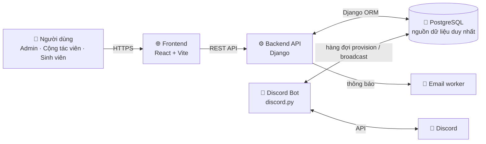

<div align="center">

# 🎪 VNUTour

**Hệ thống quản lý sự kiện tour thống nhất cho sinh viên ĐHQG TP.HCM (VNU)**

Quản lý đội & sự kiện, điểm danh bằng QR, chấm điểm thời gian thực và tích hợp Discord — tất cả trên một nền tảng duy nhất.

[](https://github.com/Hunndayne/VNUTOUR/actions/workflows/ci.yml)
[](LICENSE)
[](backend/)
[](backend/)
[](frontend/)
[](k8s/)

</div>

---

## 📋 Giới thiệu

**VNUTour** là hệ thống backend + web quản lý toàn bộ vòng đời một sự kiện tour: từ đăng ký đội, duyệt hồ sơ, phân trạm thi đấu, điểm danh bằng mã QR, đến chấm điểm và bảng xếp hạng trực tiếp. Hệ thống kết hợp một **Discord bot** (tự động tạo role/kênh, gửi thông báo) với một **web app quản trị + quét QR**, dùng chung một cơ sở dữ liệu **PostgreSQL** làm nguồn dữ liệu duy nhất.

## ✨ Tính năng chính

- 🧑‍🤝‍🧑 **Quản lý đội & sự kiện** — đăng ký theo schema động, duyệt hồ sơ, quản lý thành viên, phân chia giai đoạn (phase) và trạm (station).
- 📱 **Điểm danh bằng QR** — cộng tác viên quét mã tại từng trạm; hệ thống kiểm tra giai đoạn, ghi nhận check-in và cập nhật điểm.
- 🏆 **Chấm điểm & bảng xếp hạng** — tính điểm theo đội và cập nhật realtime.
- 🤖 **Tích hợp Discord** — bot tự động tạo role/kênh cho đội được duyệt, liên kết thành viên và gửi broadcast; toàn bộ đọc/ghi qua PostgreSQL.
- 🖼️ **Công cụ ghép khung ảnh** — trang công khai `/frame` cho phép người dùng ghép ảnh vào khung sự kiện.
- 🔗 **Rút gọn liên kết** — endpoint `/s/<code>` chuyển hướng qua Django.
- 🔐 **Xác thực đa lớp** — đăng nhập Google OAuth + email, phân quyền theo vai trò, chống bot bằng Cloudflare Turnstile.
- 📧 **Thông báo email** & 💳 **VietQR** cho các luồng nghiệp vụ.

## 🏗️ Kiến trúc



Backend theo **kiến trúc phân lớp service**: các `views_*.py` (HTTP) gọi xuống `services/*.py` (nghiệp vụ), thao tác dữ liệu hoàn toàn qua Django ORM. Web và bot chạy độc lập nhưng đồng bộ qua PostgreSQL — không có state chia sẻ nào khác.

## 🛠️ Công nghệ

| Lớp | Công nghệ |
| --- | --- |
| **Backend** | Python 3.11 · Django 5 · discord.py · Gunicorn |
| **Frontend** | React 19 · Vite 7 · Tailwind CSS 3 (router tự viết, không dùng react-router) |
| **Cơ sở dữ liệu** | PostgreSQL |
| **Lưu trữ** | Cloudflare R2 (tương thích S3), fallback volume |
| **Hạ tầng** | Docker · Kubernetes (k3s) · GitHub Actions CI/CD · Cloudflare Tunnel |
| **Tích hợp** | Google OAuth · VietQR · Cloudflare Turnstile · QR (`qrcode` / `qr-scanner`) |

## 📁 Cấu trúc thư mục

```
vnutour/
├── backend/                    # Discord bot + Django API (Python)
│   ├── main.py                 # Entry point: chạy API (+ bot khi bật)
│   ├── src/                    # Mã nguồn bot: commands, events, cogs
│   ├── webapi/                 # Django REST API
│   │   └── api/
│   │       ├── services/       # Lớp nghiệp vụ (team, checkin, score, ...)
│   │       ├── views_*.py      # HTTP handlers theo domain
│   │       └── models.py       # ORM models
│   └── requirements.txt
├── frontend/                   # Web quét QR + dashboard (React + Vite)
│   └── src/                    # App.jsx, router.js, api.js, ui.jsx, ...
├── k8s/                        # Manifest triển khai k3s
└── docs/                       # Tài liệu (ADR, agent skills, ...)
```

## 🚀 Bắt đầu nhanh

### Yêu cầu

- Python **3.11+**, Node.js **20+**, PostgreSQL **14+**

### Backend

```bash
cd backend
python -m venv .venv
source .venv/bin/activate          # Windows: .venv\Scripts\activate
pip install -r requirements.txt

cp .env.docker.example .env         # rồi điền các biến bên dưới
python webapi/manage.py migrate
python main.py                      # API; đặt RUN_DISCORD_BOT=1 để chạy kèm bot
```

### Frontend

```bash
cd frontend
npm install
cp .env.example .env                # trỏ VITE_API_BASE_URL tới backend
npm run dev
```

### Biến môi trường chính

| Biến | Vị trí | Mô tả |
| --- | --- | --- |
| `DB_NAME` / `DB_USER` / `DB_PASSWORD` | backend | Kết nối PostgreSQL |
| `DJANGO_SECRET_KEY` | backend | Khóa bí mật Django (bắt buộc ở production) |
| `DISCORD_TOKEN` / `DISCORD_GUILD_ID` | backend | Token & guild của Discord bot |
| `GOOGLE_CLIENT_ID` | backend + frontend | Google OAuth (frontend dùng `VITE_GOOGLE_CLIENT_ID`) |
| `SMTP_*` | backend | Cấu hình gửi email |
| `RUN_DISCORD_BOT` | backend | `1` để chạy bot cùng API (mặc định `0`) |
| `VITE_API_BASE_URL` | frontend | Địa chỉ backend API |

> Tham khảo đầy đủ trong `backend/.env.docker.example` và `frontend/.env.example`.
> **Không bao giờ commit file `.env` thật.**

## 🧪 Kiểm thử

```bash
cd backend
python -m pytest webapi/api/tests/ -v          # toàn bộ test
python -m pytest webapi/api/tests/ --cov=webapi/api   # kèm coverage
```

Frontend được kiểm tra qua `npm run lint` và `npm run build` (đều chạy tự động trong CI).

## 📦 Triển khai

CI (GitHub Actions) chạy test + lint, sau đó build và đẩy Docker image lên **GHCR** khi merge vào `main`. Một self-hosted runner trong LAN triển khai lên cụm **k3s** (chạy migration → cập nhật image → kiểm tra health), với Cloudflare Tunnel expose dịch vụ ra ngoài. Manifest nằm trong thư mục [`k8s/`](k8s/).

## 👥 Vai trò người dùng

| Vai trò | Quyền |
| --- | --- |
| **Admin** | Toàn quyền: duyệt đội, quản lý sự kiện/trạm, chấm điểm, cấu hình hệ thống |
| **Cộng tác viên (collab)** | Quét QR điểm danh tại trạm |
| **Sinh viên (participant)** | Xem điểm, cập nhật hồ sơ, thông tin đội |

## 🤝 Đóng góp

Rất hoan nghênh issue và pull request! Khi mở issue, hãy chọn mẫu **🐞 Báo lỗi** hoặc **✨ Đề xuất tính năng**. Với pull request, vui lòng chạy test/lint tương ứng trước khi gửi (backend: `pytest`; frontend: `npm run lint && npm run build`).

## 📄 Giấy phép

Phát hành theo giấy phép [MIT](LICENSE).
