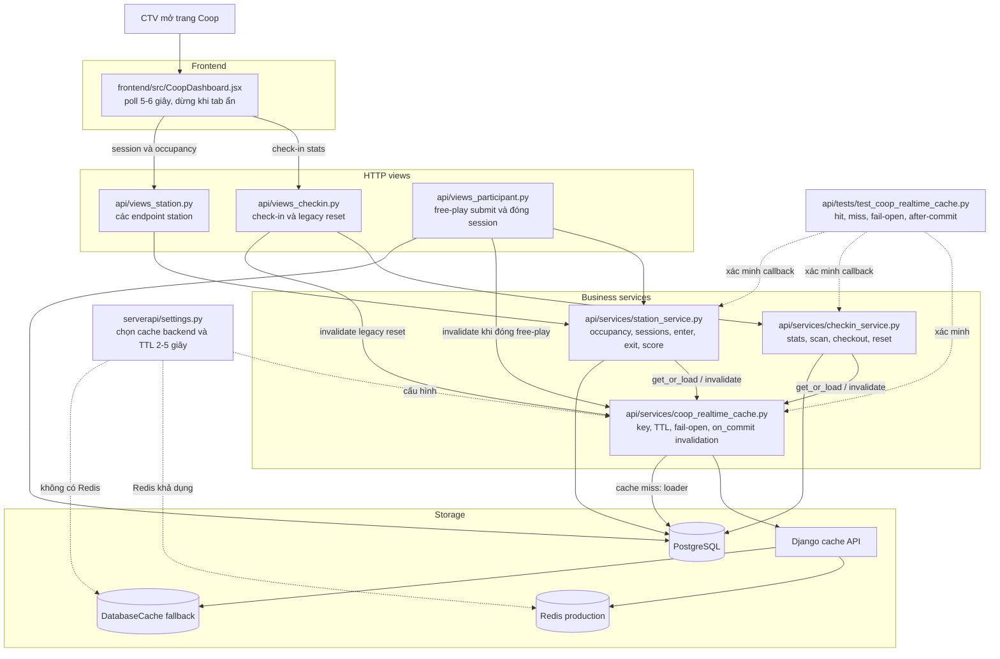
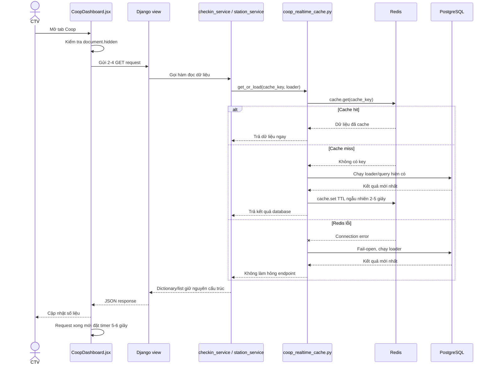
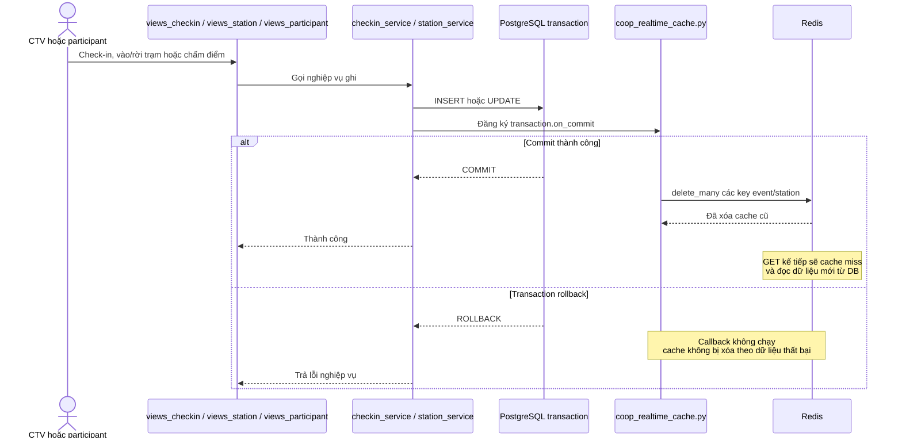

# Coop realtime cache plan

## Mục tiêu

Giảm các truy vấn database lặp lại từ trang `/coop` mà vẫn giữ dữ liệu gần realtime và không biến Redis thành nguồn dữ liệu chính.

## Hiện trạng trong codebase

`frontend/src/CoopDashboard.jsx` gọi `refreshLive` mỗi 3 giây. Mỗi lượt gọi `loadLiveData` tạo đồng thời 2–4 request:

- `GET /event-checkins/stats?phase_key=...&event_id=...`
- `GET /station-sessions?event_id=...`
- `GET /stations/:id/occupancy`
- `GET /stations/:id/sessions`

Ví dụ 20 CTV cùng mở một event/trạm tạo xấp xỉ:

```text
20 người × 4 request / 3 giây = 26,7 request/giây
```

Các response này giống nhau giữa các CTV, nhưng trước thay đổi này từng request đều chạy lại service database:

- `checkin_service.get_checkin_stats` tổng hợp attendance/check-in.
- `station_service.list_recent_sessions` đọc session mới nhất của event.
- `station_service.get_occupancy` đọc Station rồi đếm session active.
- `station_service.get_station_sessions` đọc session và submission của trạm.

## Thiết kế triển khai

### 1. Shared cache TTL ngắn

Dùng Django cache hiện có. Production đã cấu hình `default` cache dùng Redis khi có `REDIS_URL` hoặc `REDIS_HOST`.

Key được tách theo phạm vi dữ liệu:

```text
vnutour:coop-live:v1:checkin-stats:event:12:phase:qualifying
vnutour:coop-live:v1:recent-sessions:event:12
vnutour:coop-live:v1:occupancy:station:3
vnutour:coop-live:v1:station-sessions:station:3
```

TTL ngẫu nhiên 2–5 giây giúp các key của event/trạm khác nhau không đồng loạt hết hạn. Cache hoạt động fail-open: nếu Redis lỗi, request vẫn đọc database và trả dữ liệu bình thường.

Ví dụ với 20 CTV cùng xem occupancy trạm 3:

```text
Request đầu: Redis miss -> database count -> lưu Redis
19 request sau: Redis hit -> không chạy lại count trong TTL
```

Các lời gọi service có `limit` khác mặc định 50 được đọc trực tiếp từ database, tránh dùng nhầm một entry cache có hình dạng khác.

### 2. Invalidate sau transaction commit

Không xóa cache trước khi database commit. Mỗi thao tác ghi đăng ký callback `transaction.on_commit`:

- Check-in, checkout, reset hoặc undo checkout xóa các key check-in của event.
- Vào/rời trạm xóa recent sessions của event, occupancy và history của trạm.
- Chấm session/submission xóa recent sessions và history liên quan.
- Free-play tạo/đóng session cũng xóa cùng nhóm key.

Ví dụ đội vào trạm 3 thuộc event 12:

```text
INSERT StationSession
COMMIT thành công
DELETE recent-sessions:event:12
DELETE occupancy:station:3
DELETE station-sessions:station:3
```

Nếu transaction rollback, callback không chạy và cache không bị xóa dựa trên một thay đổi chưa tồn tại.

### 3. Polling phía frontend

Thay `setInterval(..., 3000)` bằng vòng `setTimeout` tự lập lịch:

- Chu kỳ 5 giây cộng jitter 0–1 giây.
- Chỉ lập lịch lượt tiếp theo sau khi request hiện tại hoàn tất.
- Dừng hoàn toàn khi `document.hidden`.
- Khi người dùng quay lại tab, refresh ngay rồi tiếp tục lịch mới.

Với 20 tab đang hiển thị, tải HTTP lý thuyết giảm từ khoảng 26,7 xuống 13,3–16 request/giây trước cả khi tính cache. Tab ẩn không còn phát sinh polling.

### 4. Kiểm thử

- Cache hit chỉ gọi loader database một lần.
- Key được cô lập theo event/station.
- TTL nằm trong 2–5 giây.
- Redis read/write lỗi không làm endpoint lỗi.
- Invalidation chỉ chạy sau commit và xóa đủ key liên quan.
- Chạy regression tests của check-in, station session, scoring và frontend lint/build.

## Workflow giữa các file sau khi chỉnh sửa

### Tổng quan file và trách nhiệm



### Luồng đọc realtime



### Luồng ghi và invalidation



## Cấu hình vận hành

```text
COOP_REALTIME_CACHE_ENABLED=1
COOP_REALTIME_CACHE_TTL_MIN_SECONDS=2
COOP_REALTIME_CACHE_TTL_MAX_SECONDS=5
```

Có thể tắt nhanh bằng `COOP_REALTIME_CACHE_ENABLED=0`; các endpoint sẽ quay về đọc database như trước.
