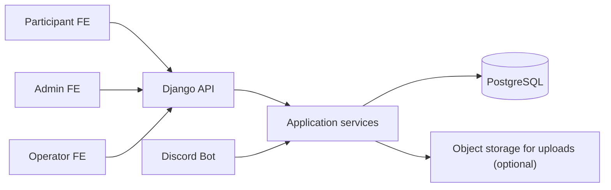

# VNUTour unified product, database, and API plan

This file is the main source of truth for the current direction.

It supersedes these older drafts when there is any conflict:

- `docs/postgresql-migration-design.md`
- `docs/frontend-feature-db-api-plan.md`
- `docs/frontend-event-phase-score-architecture.md`
- `docs/api-qr-checkin-plan.md`

---

## 1. Muc tieu

He thong phuc vu 1 mua VNUTour.

Khong can quan ly nhieu season.

Can thong nhat 1 huong cho:

- frontend admin
- frontend participant
- frontend operator check-in
- Django API
- Discord bot
- PostgreSQL schema

Huong domain da chot:

```txt
Phase co dinh -> Event con trong phase -> Tram trong event -> Diem event -> Tong diem phase -> Advancement
```

---

## 2. Cac quyet dinh da khoa

### 2.1. Database

PostgreSQL la database chinh.

Khong dung MongoDB lam source of truth nua.

Khong can dual-write Mongo/PostgreSQL.

Khong can migration du lieu production cu.

### 2.2. Mua giai

Web chi phuc vu 1 mua.

Khong tao entity `season`.

### 2.3. Phase

Phase la co dinh va chi co 4 gia tri:

1. `registration`
2. `qualifying`
3. `final`
4. `ended`

Admin khong duoc tao/xoa phase.

Admin chi duoc:

- sua `start_date`
- sua `end_date`
- chuyen `current_phase`

`label` va `hint` cua phase nen duoc seed san.

Co the luu trong DB de render FE, nhung xem nhu read-only.

### 2.4. Event

Event con nam ben trong phase.

Event la don vi nghiep vu de:

- to chuc cong viec
- nhom cac tram
- nhap diem bonus/penalty/manual
- tinh tong diem theo phase

### 2.5. Tram

Tram chi thuoc event co `uses_stations = true`.

Tram khong thuoc phase mot cach truc tiep ve nghiep vu.

Tram luon nam trong 1 event cu the.

### 2.6. Check-in

Check-in su kien la theo `event`, khong phai theo ca mua.

Vao/ra tram la `station session`, khong ghi de len station object.

### 2.7. Diem

Diem phase la tong hop cua nhieu event con.

Nguon diem gom:

1. diem tram
2. diem manual
3. diem bonus
4. diem penalty

### 2.8. QR

QR cua doi dung token rieng.

Khong expose DB id.

Format khuyen nghi:

```txt
t:<qr_token>
```

### 2.9. free_play

Neu tram co `checkin_policy = free_play` thi operator khong bat buoc scan vao/ra.

Luc nay backend khong nen xem occupancy la su that thoi gian thuc.

Neu chua co self-scan cho doi, `free_play` chi la thong tin cau hinh.

---

## 3. Vai tro va phan quyen

He thong co 3 role:

- `participant`
- `collab`
- `admin`

### participant

- dang ky, dang nhap
- cap nhat ho so ca nhan
- tao va quan ly doi cua minh
- them/sua/xoa thanh vien khi doi con editable
- submit doi cho BTC
- xem trang thai duyet
- xem QR cua doi khi duoc phep

### collab

- dang nhap van hanh
- check-in su kien
- check-in/check-out tram
- xem du lieu can cho van hanh
- co the duoc nhap diem neu setting cho phep

### admin

- toan quyen
- duyet/tu choi doi
- quan ly account
- quan ly phase/event/tram
- quan ly diem va advancement
- reset check-in
- retry Discord provisioning
- gui broadcast Discord

---

## 4. Ban do frontend hien tai

### Public/auth

- `frontend/src/LandingPage.jsx`
- `frontend/src/LoginPage.jsx`

### Participant

- `frontend/src/ParticipantDashboard.jsx`

### Admin

- `frontend/src/AdminDashboard.jsx`
- `frontend/src/EventManagementPage.jsx`
- `frontend/src/TeamsPage.jsx`
- `frontend/src/StationsPage.jsx`
- `frontend/src/ScoreManagementPage.jsx`
- `frontend/src/AccountsPage.jsx`
- `frontend/src/DiscordPage.jsx`

### Operator

- `frontend/src/CheckinPage.jsx`

Frontend hien tai da chot kien truc:

- phase co dinh
- event con theo phase
- tram theo event
- score tong hop theo event va phase
- QR page dung chung cho event check-in va station ops

Backend can map dung voi hien trang nay.

---

## 5. Kien truc backend muc tieu



Nguyen tac:

- Views chi lo HTTP, auth, response.
- Business rules nam o service layer.
- Bot va API dung chung service layer.
- PostgreSQL la source of truth.
- JSONB chi dung cho config linh hoat va payload mem.

---

## 6. Domain model

### 6.1. Account

Tai khoan dang nhap va phan quyen.

Fields:

- `id`
- `username` unique
- `email` unique
- `password_hash`
- `role`: `participant | collab | admin`
- `is_active`
- `token` unique nullable
- `mssv` unique nullable
- `full_name` nullable
- `google_sub` unique nullable
- `last_login`
- `created_at`
- `updated_at`

### 6.2. Participant

Ho so nguoi tham gia.

Fields:

- `id`
- `account_id` one-to-one nullable
- `mssv` unique
- `full_name`
- `email`
- `phone`
- `faculty`
- `school`
- `facebook`
- `discord_id` unique nullable
- `created_at`
- `updated_at`

Participant khong luu `team_id`.

Quan he doi nam o membership.

### 6.3. Team

Doi tham gia.

Fields:

- `id`
- `code` unique, vi du `T0001`
- `name`
- `owner_account_id` FK `accounts`, nullable
- `approval_status`: `draft | pending_approval | approved | rejected`
- `approval_note`
- `submitted_at`
- `reviewed_by_id` FK `accounts`, nullable
- `reviewed_at`
- `qr_token` unique
- `provision_state`: `none | pending | done | failed`
- `provision_last_error`
- `provision_retry_count`
- `last_provisioned_at`
- `discord_role_id` nullable
- `text_channel_id` nullable
- `voice_channel_id` nullable
- `created_at`
- `updated_at`

Khong nen luu `checked_in_at` global tren team.

Check-in moi phai la event-scoped.

### 6.4. TeamMembership

Bang noi team va participant.

Fields:

- `id`
- `team_id`
- `participant_id`
- `is_captain`
- `team_number` nullable
- `created_at`
- `updated_at`

Constraints:

- unique `(team_id, participant_id)`
- unique `participant_id` neu 1 participant chi duoc o 1 doi
- partial unique `team_id where is_captain = true`

### 6.5. ProgramPhase

Phase co dinh cua mua.

Fields:

- `id`
- `key` unique
- `label`
- `hint`
- `start_date`
- `end_date`
- `order`
- `is_current`
- `created_at`
- `updated_at`

Seed san 4 dong:

- `registration`
- `qualifying`
- `final`
- `ended`

### 6.6. SubEvent

Event con trong phase.

Fields:

- `id`
- `phase_id`
- `name`
- `type`: `workflow | social | station_run | quiz | submission | custom`
- `start_date`
- `end_date`
- `uses_stations`
- `note`
- `order`
- `created_at`
- `updated_at`

### 6.7. PhaseRoster

Danh sach doi duoc cham diem trong 1 phase.

Fields:

- `id`
- `phase_id`
- `team_id`
- `origin`: `approved | qualified | wildcard | manual`
- `qualified_from_phase_id` nullable
- `note`
- `created_at`

Constraint:

- unique `(phase_id, team_id)`

Roster phase tach rieng voi danh sach doi dang ky.

### 6.8. Station

Tram cua 1 event co `uses_stations = true`.

Fields:

- `id`
- `sub_event_id`
- `code`
- `name`
- `location`
- `order`
- `active`
- `checkin_policy`: `staff_scan | free_play`
- `capacity_mode`: `unlimited | limited`
- `max_concurrent_teams` nullable
- `submission_config` JSONB
- `created_at`
- `updated_at`

`submission_config` luu:

- `brief` markdown
- `form`
- `quiz`
- `attachment`

Constraint:

- unique `(sub_event_id, code)`

### 6.9. EventCheckIn

Check-in su kien theo event.

Fields:

- `id`
- `phase_id`
- `sub_event_id`
- `team_id`
- `scanner_id`
- `status`: `active | reverted`
- `ip`
- `user_agent`
- `meta` JSONB
- `created_at`
- `updated_at`

Constraint:

- partial unique `(sub_event_id, team_id) where status = 'active'`

Neu muon support nhieu loai cong check-in, moi lan van phai gan vao 1 event.

### 6.10. StationSession

Phien vao/ra tram.

Fields:

- `id`
- `phase_id`
- `sub_event_id`
- `station_id`
- `team_id`
- `status`: `active | closed | cancelled`
- `entered_at`
- `entered_by_id`
- `exited_at` nullable
- `exited_by_id` nullable
- `score` integer default 0
- `note`
- `created_at`
- `updated_at`

Constraints:

- partial unique `(station_id, team_id) where status = 'active'`
- partial unique `(sub_event_id, team_id) where status = 'active'` neu muon chan 1 doi dung o 2 tram cung luc trong cung event

### 6.11. ScoreEntry

Ledger diem theo event va phase.

Fields:

- `id`
- `phase_id`
- `sub_event_id`
- `station_session_id` nullable
- `team_id`
- `kind`: `station | bonus | penalty | manual`
- `points`
- `note`
- `created_by_id`
- `created_at`
- `updated_at`

Nguyen tac:

- diem tram co the sinh tu `station_session.score`
- bonus/penalty/manual do BTC nhap

### 6.12. AdvancementRule

Quy tac day doi sang phase sau.

Fields:

- `id`
- `from_phase_id`
- `to_phase_id`
- `mode`: `top_n | manual`
- `slots`
- `last_published_at`
- `published_by_id` nullable
- `created_at`
- `updated_at`

### 6.13. StationSubmission

Bang nay chua can o phase FE hien tai, nhung nen nam trong plan tong.

No dung khi he thong thuc su thu bai nop.

Fields:

- `id`
- `station_session_id`
- `team_id`
- `station_id`
- `status`: `draft | submitted | graded`
- `response_payload` JSONB
- `attachment_payload` JSONB
- `submitted_at`
- `graded_at` nullable
- `graded_by_id` nullable
- `created_at`
- `updated_at`

File that khong nen luu trong PostgreSQL.

Chi luu metadata file trong DB.

Bytes nen luu o object storage.

### 6.14. DiscordBroadcast

Lich su broadcast Discord.

Fields:

- `id`
- `title`
- `message`
- `target`: `all | approved | pending | team_ids`
- `target_payload` JSONB
- `sent_by_id`
- `status`: `draft | sent | failed`
- `error`
- `sent_at`
- `created_at`
- `updated_at`

### 6.15. SystemSetting

Key-value config.

Fields:

- `key` unique
- `value` JSONB
- `updated_at`

Settings ban dau:

```json
{
  "registration_open": false,
  "team_max_members": 5,
  "collab_can_edit_scores": false,
  "sheet_import_enabled": false,
  "sheet_checkin_export_enabled": false
}
```

---

## 7. Quy tac nghiep vu

### 7.1. Team va approval

- 1 account participant chi so huu 1 team active
- team `draft` va `rejected` con duoc sua
- team `pending_approval` co the khoa participant edit neu BTC muon
- team `approved` khoa participant edit, chi admin sua

### 7.2. QR

- moi team co 1 `qr_token`
- QR payload la `t:<qr_token>`
- co the rotate token neu can

### 7.3. Event check-in

- check-in su kien luon gan voi 1 `sub_event`
- 1 doi chi co 1 check-in active trong cung event
- reset check-in la doi `status` thanh `reverted` hoac soft delete theo quy uoc

### 7.4. Station policy

- `staff_scan`: vao/ra tram do operator ghi nhan
- `free_play`: khong yeu cau operator scan

Neu `free_play`, occupancy khong phai signal thoi gian thuc dang tin.

### 7.5. Capacity

- `unlimited`: khong gate so doi
- `limited`: chan enter khi so session `active` dat gioi han

### 7.6. Session

- team khong duoc `enter` 2 lan khi chua `exit`
- mac dinh team khong duoc active o 2 tram cung luc trong cung event
- neu can override, phai co explicit admin action ve sau

### 7.7. Score

Tong diem event cua 1 doi:

```txt
sum(station scores in event) + sum(manual/bonus/penalty in event)
```

Tong diem phase cua 1 doi:

```txt
sum(all event totals in phase)
```

### 7.8. Advancement

- roster phase la nguon dau vao cho leaderboard phase
- publish advancement chi tao roster cho phase sau
- khong sua ledger cua phase cu

### 7.9. Submission

FE hien tai moi cau hinh requirement.

Backend phase dau co the chi luu `submission_config`.

Khi mo real submission, them `station_submissions`.

---

## 8. API strategy

Base path:

```txt
/api
```

Nguyen tac:

- giu cac route dang duoc frontend goi truc tiep
- them route moi ro nghia khi can
- co the dung alias de khong pha FE trong qua trinh chuyen doi

### 8.1. Route compatibility bat buoc giu

Can giu:

- `/auth/login`
- `/auth/signup`
- `/auth/register`
- `/auth/google`
- `/auth/me`
- `/auth/logout`
- `/me/profile`
- `/my-team`
- `/teams`
- `/checkin`
- `/checkins`
- `/checkins/stats`
- `/settings`

### 8.2. Canonical API moi

Cho domain moi, uu tien namespace ro nghia:

- `/program/*`
- `/sub-events/*`
- `/stations/*`
- `/event-checkins/*`
- `/station-sessions/*`
- `/scores/*`
- `/discord/*`

Route cu co the la alias trong giai doan chuyen.

---

## 9. API plan chi tiet

## 9.1. Auth

| Method | Path | Role | Purpose |
|---|---|---|---|
| POST | `/auth/login` | public | Login username/password |
| POST | `/auth/signup` | public | Participant signup |
| POST | `/auth/register` | public | Alias cho signup neu FE cu can |
| POST | `/auth/google` | public | Google login/signup |
| GET | `/auth/me` | logged-in | Lay user hien tai |
| POST | `/auth/logout` | logged-in | Logout |

Response `user.role` chi dung:

- `participant`
- `collab`
- `admin`

## 9.2. Participant self-service

| Method | Path | Role | Purpose |
|---|---|---|---|
| GET | `/me/profile` | logged-in | Xem ho so |
| PATCH | `/me/profile` | logged-in | Sua ho so |
| GET | `/my-team` | participant | Lay doi cua minh |
| POST | `/my-team` | participant | Tao doi |
| PATCH | `/my-team` | participant | Sua ten doi |
| POST | `/my-team/members` | participant | Them thanh vien |
| PATCH | `/my-team/members/:mssv` | participant | Sua thanh vien |
| DELETE | `/my-team/members/:mssv` | participant | Xoa thanh vien |
| POST | `/my-team/submit` | participant | Gui duyet |
| GET | `/my-team/qr` | participant | Lay QR cua doi |

## 9.3. Teams and accounts

| Method | Path | Role | Purpose |
|---|---|---|---|
| GET | `/teams` | admin/collab | List doi |
| POST | `/teams` | admin | Tao doi bang tay |
| GET | `/teams/:team_code` | admin/collab | Chi tiet doi |
| PATCH | `/teams/:team_code` | admin | Sua doi |
| DELETE | `/teams/:team_code` | admin | Xoa doi |
| POST | `/teams/:team_code/approve` | admin | Duyet doi |
| POST | `/teams/:team_code/reject` | admin | Tu choi doi |
| GET | `/admin/accounts` | admin | List accounts |
| POST | `/admin/accounts` | admin | Tao account |
| GET | `/admin/accounts/:username` | admin | Chi tiet account |
| PATCH | `/admin/accounts/:username` | admin | Sua account |
| DELETE | `/admin/accounts/:username` | admin | Deactivate hoac xoa mem |

## 9.4. Program and sub-events

| Method | Path | Role | Purpose |
|---|---|---|---|
| GET | `/program` | admin/collab | Lay phase schedule va sub-events |
| PUT | `/program/current-phase` | admin | Dat current phase |
| PATCH | `/program/phases/:phase_key` | admin | Sua `start_date` va `end_date` |
| POST | `/program/phases/:phase_key/sub-events` | admin | Tao event con |
| PATCH | `/program/sub-events/:id` | admin | Sua event con |
| DELETE | `/program/sub-events/:id` | admin | Xoa event con |

`PATCH /program/phases/:phase_key` khong nen cho sua `key`.

`label` va `hint` chi cho sua neu team thuc su muon mo khoa.

Mac dinh xem nhu read-only.

## 9.5. Station config

| Method | Path | Role | Purpose |
|---|---|---|---|
| GET | `/program/phases/:phase_key/sub-events/:event_id/stations` | admin/collab | List tram cua event |
| POST | `/sub-events/:event_id/stations` | admin | Tao tram |
| PATCH | `/stations/:station_id` | admin | Sua tram |
| DELETE | `/stations/:station_id` | admin | Xoa tram |
| GET | `/stations/:station_id/occupancy` | admin/collab | Xem occupancy |
| GET | `/stations/:station_id/sessions` | admin/collab | Xem lich su vao/ra |

## 9.6. Event check-in

Canonical routes:

| Method | Path | Role | Purpose |
|---|---|---|---|
| POST | `/event-checkins/scan` | admin/collab | Check-in su kien |
| GET | `/event-checkins` | admin/collab | List check-in theo event |
| GET | `/event-checkins/stats` | admin/collab | Stats theo event |
| DELETE | `/event-checkins/:id` | admin | Reset check-in |

Compatibility aliases:

| Method | Path | Role | Purpose |
|---|---|---|---|
| POST | `/checkin` | admin/collab | Alias cho event check-in |
| GET | `/checkins` | admin/collab | Alias cho list |
| GET | `/checkins/stats` | admin/collab | Alias cho stats |
| DELETE | `/checkin/:team_code` | admin | Alias tam thoi cho reset |

Request canonical:

```json
{
  "phaseKey": "qualifying",
  "eventId": "qual-station-map",
  "teamCode": "T0007"
}
```

## 9.7. Station sessions

Canonical routes:

| Method | Path | Role | Purpose |
|---|---|---|---|
| POST | `/station-sessions/enter` | admin/collab | Team vao tram |
| POST | `/station-sessions/exit` | admin/collab | Team roi tram |
| GET | `/station-sessions` | admin/collab | Recent ops va lich su |

Request:

```json
{
  "phaseKey": "qualifying",
  "eventId": "qual-station-map",
  "stationId": "VL02",
  "teamCode": "T0007",
  "score": 25,
  "note": "optional"
}
```

Compatibility aliases neu can:

- `POST /stations/:station_id/enter`
- `POST /stations/:station_id/exit`

Nhung canonical van nen la `station-sessions`.

## 9.8. Scores and advancement

| Method | Path | Role | Purpose |
|---|---|---|---|
| GET | `/scores/phases/:phase_key` | admin/collab | Roster, ledger, leaderboard |
| POST | `/scores/entries` | admin, collab neu duoc phep | Tao diem manual |
| PATCH | `/scores/entries/:id` | admin | Sua diem |
| DELETE | `/scores/entries/:id` | admin | Xoa diem |
| PUT | `/scores/phases/:phase_key/advancement` | admin | Cau hinh advancement |
| POST | `/scores/phases/:phase_key/publish-advancement` | admin | Day doi sang phase sau |

## 9.9. Station submissions

Neu mo real submission:

| Method | Path | Role | Purpose |
|---|---|---|---|
| POST | `/station-submissions` | participant/collab/admin tuy flow | Nop bai |
| GET | `/station-submissions` | admin/collab | List bai nop |
| GET | `/station-submissions/:id` | admin/collab | Chi tiet bai nop |
| PATCH | `/station-submissions/:id/grade` | admin/collab | Cham bai |

## 9.10. Discord

| Method | Path | Role | Purpose |
|---|---|---|---|
| GET | `/discord/status` | admin | Bot status |
| GET | `/discord/provisioning-queue` | admin | Hang doi provision |
| POST | `/discord/teams/:team_code/provision` | admin | Retry provision |
| GET | `/discord/members` | admin | List map web <-> Discord |
| POST | `/discord/members/:mssv/sync` | admin | Sync member |
| POST | `/discord/broadcasts` | admin | Gui broadcast |
| GET | `/discord/broadcasts` | admin | Lich su broadcast |

## 9.11. Dashboard and settings

| Method | Path | Role | Purpose |
|---|---|---|---|
| GET | `/dashboard/overview?phase=` | admin/collab | KPI tong quan |
| GET | `/activity` | admin/collab | Feed gan day |
| GET | `/settings` | admin/collab | Xem settings |
| PUT | `/settings` | admin | Sua settings |

---

## 10. Error model

Giai doan dau nen giu envelope don gian:

```json
{
  "error": "error_code"
}
```

Co the them:

- `detail`
- `correlation_id`

nhung khong nen pha FE cu.

### Error codes can co

Event check-in:

- `team_not_found`
- `event_not_found`
- `already_checked_in`
- `phase_mismatch`

Station sessions:

- `station_not_found`
- `station_inactive`
- `policy_free_play`
- `station_full`
- `session_already_active`
- `session_not_found`
- `session_already_closed`

Team flow:

- `team_locked`
- `team_not_editable`
- `team_max_members_reached`
- `already_in_team`

---

## 11. Service layer responsibilities

Nen co application services dung chung cho API va bot.

Vi du:

- auth service
- team service
- program service
- station service
- score service
- discord provisioning service

Function toi thieu:

- create team
- add/remove/update member
- submit team
- approve/reject team
- scan event check-in
- enter station
- exit station
- compute leaderboard
- publish advancement
- mark provision done/failed

Views khong nen tu viet business rule.

---

## 12. Thu tu trien khai khuyen nghi

### Phase 1: foundation

- cai PostgreSQL
- doi settings Django
- tao models core: accounts, participants, teams, memberships, settings
- seed phase co dinh

### Phase 2: auth and participant portal

- login/signup/google
- `/me/profile`
- `/my-team`
- `/my-team/members`
- `/my-team/submit`

### Phase 3: admin team and account management

- `/teams`
- approve/reject
- `/admin/accounts`

### Phase 4: program and station config

- `/program`
- sub-events
- station CRUD
- luu `submission_config`

### Phase 5: event check-in

- `event_checkins`
- `/event-checkins/*`
- alias `/checkin*`
- noi FE operator event mode

### Phase 6: station sessions

- `station_sessions`
- enter/exit
- occupancy
- recent ops
- noi FE operator station modes

### Phase 7: score and advancement

- `score_entries`
- `phase_rosters`
- `advancement_rules`
- leaderboard
- publish advancement

### Phase 8: Discord

- provisioning queue
- retry
- broadcasts

### Phase 9: real submissions

- object storage
- `station_submissions`
- grading flow

---

## 13. Cac diem can canh bao

### 13.1. Khong dung global event check-in

Khong tao model check-in chi co `team_id` va `checked_in_at` global.

No se sai domain ngay khi co nhieu event.

### 13.2. Khong tron station state vao station config

`stations` la config.

`station_sessions` moi la runtime.

### 13.3. Khong dung occupancy cua free_play de gate luong vao

Neu tram free-play, occupancy khong phai source of truth runtime.

### 13.4. Khong de diem phase mat nguon goc

Moi dong diem phai trace duoc:

- phase nao
- event nao
- doi nao
- ai nhap
- vi sao co diem

---

## 14. Nhanh chot tiep theo

Neu theo dung plan nay, backend tiep theo nen chot 3 diem:

1. `collab` co duoc nhap diem hay khong
2. `free_play` co cho admin override scan hay khong
3. phase dau tien can noi API that la:
   - participant portal
   - hay QR operator

---

## 15. Ket luan

Day la huong tong the da duoc chinh lai cho khop voi frontend hien tai.

Tam diem can nho:

- phase co dinh
- event con la don vi nghiep vu
- tram thuoc event
- check-in su kien theo event
- vao/ra tram theo station session
- diem tong hop event -> phase -> advancement

Neu team code theo file nay, frontend va backend se gap nhau o cung 1 domain model.
