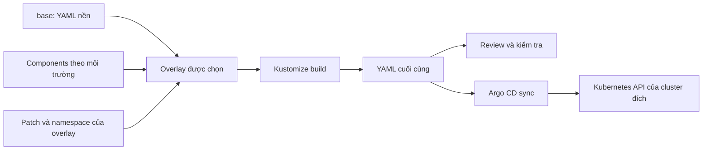
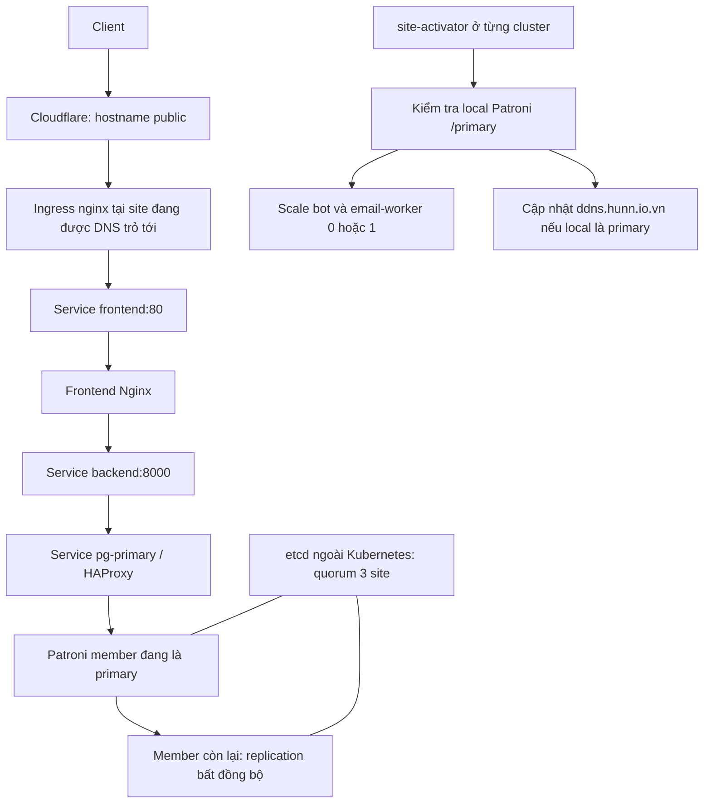
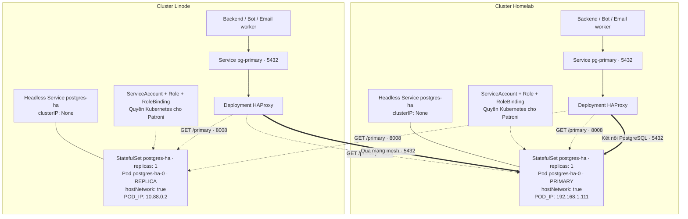

# Kustomize trong VNUTOUR: Lý thuyết, cấu hình và vận hành

> Tài liệu dành cho team phát triển và vận hành cần hiểu, thay đổi và xử lý sự cố trong thư mục `k8s/`.

## 1. Kustomize

### 1.1 Vấn đề cần giải quyết

- Khi deploy một app lên nhiều environment (dev, staging, prod), nhóm vận hành thường phải sửa YAML cho từng môi trường (khác image tag, khác replicas, khác resource limit...).
- Copy nguyên file YAML cho mỗi môi trường thì dễ bị trùng lặp, khó bảo trì, dễ config drift. Còn dùng script để sed/replace thì dễ hỏng khi có nhiều service.
- Đây chính là vấn đề Kustomize được sinh ra để giải quyết. Thay vì tạo các thư mục riêng cho từng môi trường và duy trì thủ công khi có app mới hoặc file config mới được thêm vào.

`docs(k8s): add Vietnamese Kustomize and operations guide`### 1.2 Khái niệm thành phần

| Khái niệm     | Ý nghĩa                                                        | Áp dụng tại VNUTOUR                                        |
| ------------- | -------------------------------------------------------------- | ---------------------------------------------------------- |
| Resource      | Một object Kubernetes, như Deployment, Service hoặc ConfigMap  | `base/06.backend.yaml` chứa Service và Deployment          |
| Kustomization | File chỉ dẫn cách tổng hợp/biến đổi các resource               | Mỗi`kustomization.yaml` của base và overlay                |
| Base          | Phần nền được overlay tham chiếu                               | Backend, frontend, ingress, media PVC, config và migration |
| Overlay       | Cấu hình hoàn chỉnh cho một môi trường                         | `overlays/prod/`                                           |
| Component     | Phần cấu hình tùy chọn dùng lại trong nhiều overlay            | `components/db-patroni/`                                   |
| Patch         | Thay đổi một phần của object được chọn                         | Đổi hostname hoặc`POD_IP`                                  |
| Transformer   | Quy tắc như đổi namespace hoặc image                           | `namespace: vnutour`, `images:`                            |
| Render/build  | Chuyển cây cấu hình thành các object cuối cùng                 | Output của`kubectl kustomize`                              |
| Reconcile     | So sánh trạng thái mong muốn và thực tế, đưa chúng về gần nhau | Argo CD và các controller Kubernetes làm việc này          |

### 1.3 Ý tưởng cốt lõi

- Kustomize lấy YAML nền, kết hợp các phần dùng chung rồi áp dụng biến đổi để tạo YAML Kubernetes cuối cùng. Nó không yêu cầu viết YAML thành template có biến `{{ ... }}`. `kubectl kustomize <directory>` chỉ render; `kubectl apply -k <directory>` render rồi gửi tài nguyên lên API server. Xem [hướng dẫn chính thức Kubernetes](https://kubernetes.io/docs/tasks/manage-kubernetes-objects/kustomization/).
- Ví dụ: Giống như một cuốn sách công thức nấu ăn cho YAML, chúng ta giữ một bộ **file base**, rồi tạo **overlay** chỉ chỉnh những phần cần thay đổi, giống như có một công thức pizza cơ bản rồi thêm topping khác nhau cho từng dịp mà không cần viết lại cả công thức.

### 1.4 Cách vận hành

- `kustomization.yaml` liệt kê resources (các file YAML gốc).
- Nhóm vận hành thêm patches, images, configMapGenerator, secretGenerator... để override một phần.
- Chạy câu lệnh `kubectl apply -k <dir>` hoặc `kustomize build <dir> | kubectl apply -f -`. Lúc này Kustomize "build" ra manifest cuối cùng, merge base + overlay lại thành 1 bộ YAML thuần túy.
- Mọi artifact mà Kustomize dùng đều là YAML thuần, nên có thể validate và xử lý như YAML bình thường - không có templating language riêng (khác Helm).



- Trong luồng GitOps, Argo CD tự lấy Git và render đường dẫn overlay đã khai báo. File YAML xuất ra khi review là bản xem trước, không phải file cần commit thay cho source.

### 1.5 Lưu ý

- Component của repo dùng `apiVersion: kustomize.config.k8s.io/v1alpha1`, `kind: Component`; base/overlay dùng `v1beta1`, `kind: Kustomization`. Component có thể thêm resource và biến đổi các resource đã được tích lũy. Vì vậy **thứ tự component có thể ảnh hưởng kết quả**, không chỉ cách trình bày file. Xem [ví dụ component chính thức](https://github.com/kubernetes-sigs/kustomize/blob/master/examples/components.md).

## 2. Cấu trúc thư mục k8s/ trong dự án

- `kustomize/base/` chứa cấu hình nền, hiện có mặc định của staging.
- `kustomize/components/` chứa phần tái sử dụng: database, cấu hình prod, image và failover.
- `kustomize/overlays/` là điểm vào để build từng môi trường: `staging`, `prod`, `prod-standby`.
- `argocd/` quyết định branch, cluster đích và chính sách đồng bộ. Kustomize tự nó không chọn cluster.
- Các YAML đánh số nằm trực tiếp dưới `k8s/` là luồng manifest riêng. Sửa chúng không tự làm thay đổi bản build Kustomize.
- Đọc **mục 10** trước khi vận hành: có khác biệt giữa comment cũ và manifest, đặc biệt image của bot/worker, PreSync và quyền quản lý replica.

## 3. Bản đồ thư mục và phạm vi quản lý

```text
k8s/
├── 00.namespace.yaml … 10.ingress.yaml  # Manifest triển khai trực tiếp
├── 11.monitoring-namespace.yaml … 15.grafana.yaml
├── 16.backup-cronjob.yaml
├── 02.secret.yaml                     # Mẫu secret; không nằm trong build
├── staging/02.secret.yaml             # Mẫu cho staging; không nằm trong build
├── argocd/
│   ├── staging-app.yaml
│   ├── prod-app.yaml
│   └── prod-standby-app.yaml
├── kustomize/
│   ├── base/
│   │   ├── kustomization.yaml
│   │   ├── 00.namespace.yaml
│   │   ├── 01.configmap.yaml
│   │   ├── 03.storage.yaml
│   │   ├── 05.migrate-job.yaml
│   │   ├── 06.backend.yaml
│   │   ├── 09.frontend.yaml
│   │   └── 10.ingress.yaml
│   ├── components/
│   │   ├── db-simple/                 # PostgreSQL đơn cho staging
│   │   ├── db-patroni/                # Patroni, HAProxy, RBAC cho prod
│   │   ├── prod-config/               # Host, DB_HOST, sizing, PVC prod
│   │   ├── images/                    # Tag backend/frontend chung cho prod
│   │   ├── failover-workloads/        # Bot và email-worker, replicas: 0
│   │   └── site-failover/             # Script, Deployment và RBAC activator
│   └── overlays/
│       ├── staging/
│       ├── prod/
│       └── prod-standby/
├── host-firewall.nft
├── update-cloudflare-ips.sh
├── cert-manager-issuer.yaml
├── README.md
└── RUNBOOK.md
```

- Kustomize chỉ đọc những gì được nối vào cây `resources`, `components`, `patches` của điểm build. Số thứ tự `00`, `01`... **không tạo thứ tự readiness hoặc migration**. File `db-patroni/linode-patch.yaml` hiện chỉ là tham chiếu; standby dùng patch inline riêng, nên sửa file tham chiếu đó không đổi output.
- Monitoring `11–15`, backup CronJob `16`, firewall, script cập nhật IP và issuer không được bất kỳ overlay hiện tại nào render. Argo CD Application cũng không nằm trong output overlay: đó là resource điều khiển được quản lý trên cluster chạy Argo CD.
- Không dùng `kubectl apply -f k8s/` hoặc `kubectl apply -R -f k8s/` như lệnh triển khai chung: thư mục chứa nhiều luồng, mẫu secret và tài nguyên có phạm vi khác nhau. Với tài nguyên đã do Argo CD quản lý, thay đổi đúng source Kustomize.

## 4. Cấu hình các môi trường

### 4.1 Thuộc tính

| Thuộc tính              | staging                     | prod - homelab                                                               | prod-standby - Linode     |
| ----------------------- | --------------------------- | ---------------------------------------------------------------------------- | ------------------------- |
| Namespace render        | `vnutour-staging`           | `vnutour`                                                                    | `vnutour`                 |
| Base                    | `k8s\kustomize\base`        | `k8s\kustomize\base`                                                         | `k8s\kustomize\base`      |
| Components theo thứ tự  | `db-simple`                 | `prod-config`, `images`, `db-patroni`, `failover-workloads`, `site-failover` | Giống prod                |
| Host Ingress            | `vnutour.hunn.io.vn`        | `vnutour.suctremmt.com`                                                      | `vnutour.suctremmt.com`   |
| DB_HOST                 | `postgres`                  | `pg-primary`                                                                 | `pg-primary`              |
| Database                | StatefulSet`postgres`       | StatefulSet`postgres-ha`                                                     | StatefulSet`postgres-ha`  |
| Frontend replicas       | 1                           | 2                                                                            | 2                         |
| Backend replicas        | 1                           | 1                                                                            | 1                         |
| Backend request / limit | `100m,256Mi` / `500m,512Mi` | `250m,512Mi` / `1 CPU,1Gi`                                                   | Giống prod                |
| media-data              | 5Gi                         | 10Gi,`Prune=false`                                                           | 10Gi,`Prune=false`        |
| Migration Job           | Có                          | Có                                                                           | Bị patch xóa              |
| Bot / email worker      | Không có                    | Mỗi Deployment khai báo 0                                                    | Mỗi Deployment khai báo 0 |
| POD_IP của Patroni      | Không áp dụng               | `192.168.1.111`                                                              | `10.88.0.2`               |
| Số object trong output  | 12                          | 24                                                                           | 23                        |

- Sơ đồ miêu tả hạ tầng on-premises ở file [k3s-onprem-infra.md](/docs/infrastructure/k3s-onprem-infra.md)
- Số object trên **không tính Pod/ReplicaSet** hoặc PVC được controller tạo sau này. Đặc biệt `volumeClaimTemplates` của `postgres-ha` sẽ tạo PVC khi StatefulSet chạy; đó không phải một tài liệu PVC độc lập trong output build.
- Hai namespace tên `vnutour` thuộc **hai cluster khác nhau**. Namespace không đủ để phân biệt môi trường; mọi thao tác vận hành phải **xác định cả context và namespace**.

### 4.2 Truy vết một giá trị từ source đến output

Với `DB_HOST` của production:

1. `base/01.configmap.yaml` khai báo `postgres`.
2. `components/prod-config/kustomization.yaml` patch `/data/DB_HOST` thành `pg-primary`.
3. Overlay prod đưa namespace về `vnutour`.
4. Deployment backend lấy biến từ ConfigMap `backend-config`, sau đó từ Secret `backend-secret`.
5. Nếu Secret cũng có `DB_HOST`, giá trị Secret sẽ thắng khi nạp `envFrom`; output ConfigMap đúng chưa chứng minh Pod dùng đúng giá trị.

Với `frontend.spec.replicas`, base là 1, `prod-config` đổi thành 2 và cả hai overlay prod nhận cùng thay đổi. Với `patroni.env.POD_IP`, component mặc định homelab rồi standby patch container `patroni`, biến `POD_IP`, thành IP mesh Linode.

## 5. Ví dụ chỉnh sửa áp dụng cho nhóm vận hành

> [!NOTE]
> Các ví dụ là hướng dẫn thay đổi trong PR, chưa được áp dụng vào manifest đang có. Đường dẫn lệnh bên dưới tính từ root repository.

### 5.1. Thay đổi chung hay riêng một môi trường?

| Nhu cầu                                          | Nơi sửa                                                                                |
| ------------------------------------------------ | -------------------------------------------------------------------------------------- |
| Probe backend dùng cho cả ba môi trường          | `kustomize/base/06.backend.yaml`                                                       |
| Host, URL, sizing chung của hai site prod        | `kustomize/components/prod-config/kustomization.yaml`                                  |
| IP quảng bá Patroni hoặc DNS target riêng Linode | `kustomize/overlays/prod-standby/kustomization.yaml`                                   |
| Tag staging                                      | Trường`images` của overlay staging; file ghi rõ CI quản lý                             |
| Tag backend/frontend prod                        | `kustomize/components/images/kustomization.yaml`; phối hợp luồng phát hành quản lý tag |
| Logic scale/DNS/failback                         | `kustomize/components/site-failover/script.yaml`                                       |
| Cách Argo CD xử lý drift/prune                   | Application tương ứng trong`argocd/`                                                   |
| Backup hoặc monitoring hiện tại                  | Manifest trực tiếp`11–16`; chưa nằm trong Kustomize                                    |

### 5.2. JSON Patch: đổi một giá trị chính xác

- Đây là kiểu patch đang có trong `prod-config`, ví dụ đổi `DB_HOST`:

```yaml
patches:
  - target:
      kind: ConfigMap
      name: backend-config
    patch: |-
      - op: replace
        path: /data/DB_HOST
        value: pg-primary
```

- `target` chọn object; `path` chọn trường. `replace` yêu cầu đường dẫn tồn tại.
- Các path có `/containers/0/` hoặc `/rules/0/` phụ thuộc vị trí phần tử; nếu thêm container hoặc rule vào đầu danh sách phải kiểm tra lại patch. Trong JSON Pointer, dấu `/` trong tên key được viết là `~1`, dấu `~` là `~0`. Xem [tham chiếu patches](https://github.com/kubernetes-sigs/kustomize/blob/master/site/content/en/docs/Reference/API/Kustomization%20File/patches.md).

### 5.3. Strategic merge: chỉnh container theo tên

- Ví dụ thử tăng memory limit của backend **chỉ ở staging**, thêm mục sau vào `patches` của overlay staging:

```yaml
patches:
  - target:
      kind: Deployment
      name: backend
    patch: |-
      apiVersion: apps/v1
      kind: Deployment
      metadata:
        name: backend
      spec:
        template:
          spec:
            containers:
              - name: backend
                resources:
                  limits:
                    memory: 768Mi
```

- Với Deployment Kubernetes, danh sách container được ghép theo `name`, nên không cần giả định backend luôn ở chỉ số 0. Kết quả mong đợi: staging đổi `512Mi → 768Mi`, hai site prod vẫn `1Gi`. Giữ nguyên các mục `patches` khác nếu file đã có trường này; không tạo hai key `patches` trong cùng YAML.

### 5.4. Bỏ resource khỏi một overlay

- Standby hiện xóa migration Job bằng:

```yaml
patches:
  - patch: |-
      $patch: delete
      apiVersion: batch/v1
      kind: Job
      metadata:
        name: vnutour-migrate
        namespace: vnutour-staging
```

- Namespace ở đây khớp định danh resource gốc từ base. Bản build đã kiểm tra không còn Job trên standby. Không đổi thành `vnutour` chỉ vì đó là namespace cuối cùng mà chưa build lại.

### 5.5. Image và ảnh hưởng của thứ tự component

- Component `images` đang khai báo:

```yaml
images:
  - name: ghcr.io/hunndayne/vnutour-backend
    newTag: 1ba61c7
  - name: ghcr.io/hunndayne/vnutour-frontend
    newTag: 1ba61c7
```

- Tag trên chỉ là snapshot lúc viết tài liệu. Trong bản build đã kiểm tra:

| Workload           | staging   | prod      | prod-standby |
| ------------------ | --------- | --------- | ------------ |
| Backend            | `c9f4f79` | `1ba61c7` | `1ba61c7`    |
| Frontend           | `c9f4f79` | `1ba61c7` | `1ba61c7`    |
| Migration          | `c9f4f79` | `1ba61c7` | Không có     |
| Bot / email worker | Không có  | `latest`  | `latest`     |

- Nguyên nhân: component `images` chạy trước `failover-workloads`; bot/worker được thêm sau với image `:latest`. Không thể kết luận mọi workload dùng chung tag chỉ bằng việc nhìn thấy component `images`.
- **Phương án sửa cho PR riêng:** chuyển `../../components/images` xuống cuối danh sách components trong **cả hai overlay prod**, rồi build lại. Điều kiện chấp nhận: backend, migration (nếu có), bot và worker đều dùng tag backend được phát hành; frontend dùng tag frontend tương ứng. Cần kiểm tra với phiên bản Kustomize của Argo CD. Tài liệu này giữ nguyên thứ tự hiện tại để phản ánh đúng source.

## 6. Hệ thống hoạt động sau khi được triển khai



- Ingress trong base chuyển mọi request tới frontend. Comment của manifest mô tả Nginx frontend chuyển `/api/` và `/media/` về backend; tài liệu này không kiểm tra implementation Nginx ngoài `k8s/`.
- Với `staging`, backend dùng trực tiếp Service `postgres`, không có HAProxy hoặc activator.

### 6.1 Database production

- `db-patroni` tạo StatefulSet `postgres-ha` một replica ở mỗi cluster, Service `headless`, RBAC và Deployment HAProxy. `hostNetwork: true` (Pod dùng mạng của node để giao tiếp) cùng `POD_IP` cố định cho phép dùng địa chỉ `node/mesh`; mỗi node phải có label `vnutour/storage=true`. HAProxy kiểm tra `/primary` trên cổng 8008 của hai node và chuyển kết nối PostgreSQL đến primary qua cổng 5432.
  - Nét đứt: mỗi HAProxy kiểm tra cả hai node qua :8008/primary. Primary trả HTTP 200.
  - Nét đậm: cả hai HAProxy đưa kết nối database tới primary qua cổng 5432.



- `ETCD3_HOSTS` chỉ tới `192.168.1.111:2379`, `10.88.0.2:2379`, `10.88.0.3:2379`; repo không triển khai etcd trong overlay. Bootstrap khai báo replication bất đồng bộ (`synchronous_mode: false`: ghi ở máy chính trước, sao chép sang máy dự phòng sau) và `maximum_lag_on_failover: 10485760` (không chọn máy dự phòng bị tụt quá xa). Đây không phải cam kết mất dữ liệu bằng 0 hay SLA phục hồi. Các giá trị dưới `bootstrap.dcs` cũng không chứng minh cấu hình DCS đang chạy đã được cập nhật sau bootstrap.
- Tên overlay `prod-standby` không khóa database thành replica vĩnh viễn. Vai trò primary/replica thay đổi khi failover. Không scale StatefulSet database lên 2 như cách scale frontend; cấu hình host networking, member identity và storage cần thiết kế riêng cho việc thêm member.

### 6.2 Site activator

- Site activator tự động bật/tắt bot, email worker và cập nhật DNS theo site đang giữ database primary. Mỗi cluster có một activator riêng, chạy script trong [`script.yaml`](/k8s/kustomize/components/site-failover/script.yaml).
- Sau mỗi vòng kiểm tra, script nghỉ INTERVAL=10 giây rồi tiếp tục:
  1. **Database local là primary**: bật bot và email worker bằng cách đặt mỗi Deployment thành replicas: 1. Sau đó cập nhật DNS về site này nếu record chưa đúng.
  2. **Database local không phải primary hoặc kiểm tra thất bại**: đặt bot và email worker thành replicas: 0, đồng thời không thay đổi DNS.
  3. **Riêng Homelab khi phục hồi**: nếu member local liên tục báo trạng thái running hoặc streaming, script tăng bộ đếm. Khi đạt FAILBACK_STABILIZE=300, script gọi patronictl switchover trong Pod local để yêu cầu chuyển primary về Homelab. Đây là cơ chế failback, giúp đưa hệ thống về site chính sau sự cố.

- Ví dụ, khi Homelab gặp sự cố và Patroni chuyển Linode thành primary, activator ở Linode sẽ bật bot/worker và cập nhật DNS về Linode. Khi Homelab phục hồi ổn định, activator ở Homelab yêu cầu chuyển primary trở lại.
- Cách chuyển hướng truy cập: Script cập nhật record trung gian `ddns.hunn.io.vn` theo site đang active.

| Site    | Member được cấu hình | DNS target khi active |
| ------- | -------------------- | --------------------- |
| Homelab | `vnutour-w1`         | CNAME`vpn.hunn.io.vn` |
| Linode  | `localhost`          | A`172.104.186.118`    |

- Người dùng vẫn truy cập `vnutour.suctremmt.com`. Theo mô tả trong script, hostname public sử dụng record trung gian để tìm tới site đang phục vụ; cần đối chiếu cấu hình DNS thực tế khi xử lý sự cố.
- Record `ddns.hunn.io.vn` được đặt `ttl: 60` và `proxied: false`, nghĩa là chỉ làm nhiệm vụ phân giải DNS, không bật Cloudflare proxy tại record trung gian này.
- Lưu ý khi vận hành:
  - **Không có thời gian chuyển đổi cố định**: 10 giây là thời gian nghỉ giữa các vòng; ngưỡng 300 tương đương khoảng 5 phút đếm. Thời gian gọi API, chuyển primary và cache DNS có thể làm quá trình thực tế lâu hơn.
  - **Database primary chưa đồng nghĩa website đã sẵn sàng**: script không kiểm tra readiness của backend/frontend trước khi cập nhật DNS.
  - **Lệnh scale có thể thất bại**: script bỏ qua lỗi scale và tiếp tục chạy. Vì vậy, không thể bảo đảm bot/worker ở site cũ đã dừng trước khi site mới bật chúng.

- Sau failover hoặc failback, cần kiểm tra website truy cập được, database primary nằm đúng site, bot/worker chạy tại site active và đã dừng ở site còn lại.

## 7. Argo CD, migration và quyền quản lý

### 7.1 Application đang khai báo gì?

| Application            | Git revision | Overlay                 | Destination server               | Auto prune | Self-heal |
| ---------------------- | ------------ | ----------------------- | -------------------------------- | ---------- | --------- |
| `vnutour-staging`      | `staging`    | `overlays/staging`      | `https://192.168.1.110:6443`     | true       | true      |
| `vnutour-prod`         | `main`       | `overlays/prod`         | `https://192.168.1.110:6443`     | false      | true      |
| `vnutour-prod-standby` | `main`       | `overlays/prod-standby` | `https://kubernetes.default.svc` | true       | true      |

- Paths trong bảng tính từ `k8s/kustomize/`. Build staging tại checkout hiện tại không chứng minh output trên branch `staging` giống hệt. Trước release cần kiểm tra đúng revision mà Application đang theo dõi.
- `selfHeal` đưa drift về Git; `prune` cho phép xóa resource thuộc phạm vi quản lý khi nó biến mất khỏi source. Tắt prune không ngăn cập nhật tài nguyên hiện có. Các Application có `finalizer` phục vụ cascade deletion; không xem `prune: false` là bảo vệ chung cho thao tác xóa Application.
  `
- Tất cả Application dùng `ServerSideApply=true`. Staging và standby có `CreateNamespace=true`; prod không có tùy chọn này. Base vẫn render Namespace, nhưng điều đó không giải quyết mọi dependency của PreSync trên namespace mới.

### 7.2 Migration là hook của Argo CD

- [`base/05.migrate-job.yaml`](/k8s/kustomize/base/05.migrate-job.yaml) dùng `PreSync`, chạy `migrate --noinput` rồi `seed_phases`, với deadline 1200 giây, `backoffLimit: 3`. `HookSucceeded,BeforeHookCreation` dọn Job thành công và xóa bản hook cũ trước lần tạo tiếp theo. Hook lỗi chặn bước sync tiếp theo; **không tự rollback schema/database**. `kubectl apply -k` không thực thi thứ tự hook của Argo CD. Xem [resource hooks](https://argo-cd.readthedocs.io/en/stable/user-guide/resource_hooks/).

Hai hệ quả quan trọng từ manifest:

- Cluster mới chưa có ConfigMap, Secret, Service/DB sẽ không thể chạy hook vốn cần chúng trước Sync. Bootstrap phải đưa dependency vào trước, chờ DB sẵn sàng rồi mới thực hiện luồng hook đầy đủ; không chỉ bật auto-sync trên môi trường rỗng.
- Khi đổi ConfigMap và image cùng lần sync, PreSync có thể đọc **ConfigMap đang tồn tại từ lần trước**. Đồng thời standby không có migration hook; hai Application prod không có cơ chế chờ nhau trong các file này. Migration cần tương thích với phiên bản ứng dụng đang chạy và phiên bản đang triển khai.

### 7.3 Ai sở hữu phần nào?

| Phần                                                       | Nguồn quản lý mong muốn        | Lưu ý                                          |
| ---------------------------------------------------------- | ------------------------------ | ---------------------------------------------- |
| Backend/frontend, ConfigMap, Ingress, Patroni, HAProxy     | Git Kustomize → Argo CD        | Thay đổi imperative có thể bị self-heal ghi đè |
| Template/image bot và worker                               | Git Kustomize → Argo CD        | Hiện vẫn render`latest`, xem mục 5.5           |
| Replica bot và worker lúc chạy                             | `site-activator`               | Git baseline 0, local leader quyết định 0/1    |
| DB leadership                                              | Patroni + etcd                 | Không do tên overlay quyết định                |
| DNS failover record                                        | `site-activator`               | Secret Cloudflare nằm ngoài Git                |
| Secret ứng dụng, TLS, pull credential, Patroni, Cloudflare | Quy trình cấp secret ngoài Git | Không render secret thật từ overlay            |
| Monitoring, backup`11–16`                                  | Luồng quản lý riêng            | Không tự cập nhật theo component images        |

- Hai Application prod bỏ qua diff `/spec/replicas` của bot/worker và `/spec/volumeClaimTemplates` của `postgres-ha`. Nhưng chúng **chưa có `RespectIgnoreDifferences=true`**: bỏ qua khi tính diff không đồng nghĩa bỏ qua trường lúc sync.
- Cần kiểm thử đầy đủ một sync có thay đổi khác, theo dõi replica có về 0 tạm thời không; việc ignore cả volumeClaimTemplates cũng có thể che thay đổi cần review. Xem [Argo CD sync options](https://argo-cd.readthedocs.io/en/stable/user-guide/sync-options/#respect-ignore-differences-configs).

## 8. Quy trình duy trì và phát hành

### 8.1 Trước khi đưa thay đổi vào Git

1. Xác định môi trường chịu ảnh hưởng theo bảng ở mục [5.1](#51-thay-đổi-chung-hay-riêng-một-môi-trường). Sửa base ảnh hưởng cả ba; sửa shared prod component ảnh hưởng hai site.
2. Sửa source nhỏ, có mục tiêu rõ. Với trường bị nhiều tầng ghi đè, đọc output cuối cùng.
3. Build cả ba overlay. Kiểm tra namespace, host, DB_HOST, image của từng workload, replica, migration và PVC.
4. Review diff YAML render trước/sau ngoài diff source. Xác nhận không có Secret thật hay thay đổi định danh resource ngoài ý muốn.
5. Đưa thay đổi qua PR trên đúng branch mà Application theo dõi. Tag image phải tồn tại trong registry; phối hợp với CI theo comment source. Tài liệu này không xác nhận trigger/promotion của workflow ngoài `k8s/`.
6. Khi Argo CD sync, theo dõi hook, rollout, health của ứng dụng và trạng thái cả hai site prod. Rollback image bằng thay đổi Git về tag đã biết; đánh giá tương thích schema trước khi rollback ứng dụng.

- Lệnh render không cần cluster:

```bash
kubectl version --client
kubectl kustomize k8s/kustomize/overlays/staging
kubectl kustomize k8s/kustomize/overlays/prod
kubectl kustomize k8s/kustomize/overlays/prod-standby
```

- Nên dùng cùng phiên bản Kustomize giữa máy review và Argo CD hoặc kiểm tra chéo output. Build thành công chỉ xác nhận tổng hợp được YAML; không xác nhận schema phía server, image pull, mạng, secret, dung lượng node hoặc readiness.

### 8.2 Cấp cấu hình nhạy cảm và dependency

- Trước bootstrap, chuẩn bị namespace, storage class `local-path`, node label, ingress controller class `nginx`, kết nối mesh và etcd cho prod, đăng ký cluster đích cho Argo CD. Mỗi namespace/cluster cần các secret phù hợp:

| Secret           | Dùng ở đâu                                | Nội dung/điểm kiểm tra                                                                     |
| ---------------- | ----------------------------------------- | ------------------------------------------------------------------------------------------ |
| `backend-secret` | Staging và hai site prod                  | `DB_NAME`, `DB_USER`, `DB_PASSWORD`, `DJANGO_SECRET_KEY`, các credential ứng dụng cần dùng |
| `vnutour-tls`    | Namespace ứng dụng từng cluster           | Certificate/key, SAN phù hợp hostname                                                      |
| `ghcr`           | Theo cách cấp pull credential của cluster | README mô tả gắn vào ServiceAccount`default`; xác minh trên cluster                        |
| `patroni-secret` | Hai site prod                             | `superuser-password`, `replication-password` thống nhất theo thiết kế DB                   |
| `cf-dns-secret`  | Hai site prod                             | `CF_API_TOKEN`, `CF_ZONE_ID` cho DNS record activator quản lý                              |

- Không apply mẫu `02.secret.yaml` lên secret thật. Secret nên chỉ chứa các khóa cần bảo mật để tránh vô tình ghi đè ConfigMap. Đổi password trong Secret không đồng nghĩa đổi password user trong database đã khởi tạo; phải có bước rotation tương ứng ở DB.

### 8.3 Thay ConfigMap cần lưu ý rollout

- Repo dùng ConfigMap tên cố định, không dùng `configMapGenerator` tạo tên có hash. Thay dữ liệu ConfigMap không tự thay Pod template của backend. Biến môi trường từ `envFrom` chỉ được nạp khi container khởi động. Script activator đang chạy cũng không tự khởi động lại chỉ vì file mount đổi; HAProxy cần quy trình reload/restart phù hợp khi cấu hình đổi.
- Với thay đổi config cần restart, đưa annotation phiên bản vào Pod template trong Git để Argo CD rollout đúng workload, ví dụ:

```yaml
spec:
  template:
    metadata:
      annotations:
        vnutour/config-revision: "2026-09-09-01"
```

- Đây là mảnh patch minh họa, cần đặt trong patch chọn Deployment thích hợp. Nếu thao tác restart khẩn cấp trên cluster, cập nhật lại Git và theo dõi self-heal; backend dùng `Recreate` nên có khoảng gián đoạn khi thay Pod.

## 9. Kiểm tra và xử lý sự cố

- Các lệnh sau dùng **Bash**, chạy từ repository trên máy có kubeconfig. Thay context trước khi chạy; không có context mặc định chung cho homelab và Linode.

```bash
kubectl config get-contexts
CTX=ten-context-homelab
NS=vnutour
OVERLAY=k8s/kustomize/overlays/prod

# Đối chiếu với API server, không lưu thay đổi workload.
kubectl --context "$CTX" apply --dry-run=server -k "$OVERLAY"
kubectl --context "$CTX" diff -k "$OVERLAY"

kubectl --context "$CTX" -n "$NS" get deploy,sts,pods,svc,ingress,pvc
kubectl --context "$CTX" -n "$NS" get events --sort-by=.lastTimestamp
kubectl --context "$CTX" -n "$NS" rollout status deployment/backend --timeout=300s
kubectl --context "$CTX" -n "$NS" rollout status deployment/frontend --timeout=300s
kubectl --context "$CTX" -n "$NS" get deploy -o 'custom-columns=NAME:.metadata.name,DESIRED:.spec.replicas,READY:.status.readyReplicas,IMAGES:.spec.template.spec.containers[*].image'
kubectl --context "$CTX" -n "$NS" logs deployment/site-activator --tail=100
kubectl --context "$CTX" -n "$NS" logs postgres-ha-0 -c patroni --tail=100
```

- `kubectl diff` trả 1 nếu có khác biệt, lớn hơn 1 khi lỗi. Dry-run cần kết nối/quyền API và không chạy hook; Job đã tồn tại có thể báo immutable dù Argo CD bình thường sẽ xóa/tạo lại theo hook policy. Output diff/dry-run không thay thế đánh giá trạng thái sync của Argo CD.
- Trạng thái Application đọc ở context của cluster **chạy Argo CD**, theo mô hình mô tả trong `prod-app.yaml` là Linode:

```bash
ARGO_CTX=ten-context-linode
kubectl --context "$ARGO_CTX" -n argocd get applications
kubectl --context "$ARGO_CTX" -n argocd get application vnutour-prod -o 'jsonpath={.status.sync.status}{" "}{.status.health.status}{"\n"}'
```

- Với staging, đặt `NS=vnutour-staging`, chọn overlay staging, kiểm tra `statefulset/postgres`; không chạy lệnh `postgres-ha` hoặc `site-activator` vì chúng không được render ở staging.

| Triệu chứng                               | Kiểm tra theo cấu hình repo                                                                                                    |
| ----------------------------------------- | ------------------------------------------------------------------------------------------------------------------------------ |
| Patch không tìm thấy target/path          | `kind`, `name`, namespace gốc, component có được include không; path JSON có còn tồn tại không                                 |
| Sửa YAML nhưng build không đổi            | Có sửa nhầm manifest trực tiếp hoặc`linode-patch.yaml` tham chiếu không? Có patch tầng sau ghi đè không?                       |
| Bot/worker vẫn dùng image cũ hoặc`latest` | Kiểm tra output từng Deployment và thứ tự component images                                                                     |
| Pod Pending                               | `describe pod`, node label `vnutour/storage=true`, PVC binding, tài nguyên node                                                |
| ImagePullBackOff                          | Tag đã push chưa; quyền GHCR và imagePullSecrets của ServiceAccount sử dụng                                                    |
| CreateContainerConfigError                | Secret/ConfigMap có tồn tại trong đúng namespace và đủ key không? Không cần in giá trị secret để kiểm tra sự tồn tại           |
| PreSync treo hoặc thất bại                | `describe job vnutour-migrate`; log container `wait-for-postgres` và `migrate`; DB_HOST live, dependency bootstrap, image pull |
| Backend dùng config cũ                    | Secret có ghi đè key không; Pod đã được tạo lại sau thay ConfigMap chưa                                                        |
| Bot/worker ở 0                            | Local site có thực sự giữ DB primary không; activator còn chạy và có quyền scale không                                         |
| Replica bị về 0 khi sync                  | Kiểm tra ignoreDifferences và thiếu RespectIgnoreDifferences; xem cả Argo CD lẫn activator                                     |
| Patroni không ổn định                     | Reachability của etcd quorum, mesh, POD_IP, secret, PVC và log Patroni                                                         |
| DNS trỏ site mới nhưng web lỗi            | Kiểm tra backend/frontend readiness, Ingress/TLS và DB connection; activator không gate theo app health                        |
| PVC OutOfSync                             | Không giảm request thấp hơn capacity; local-path/volumeClaimTemplates có hạn chế thay đổi; tránh xóa PVC để chữa sync          |

- Backend vẫn gắn `media-data` và dùng `Recreate`; HA database không đồng bộ volume media giữa hai site. Monitoring/backup không được overlay render, nên cần xác minh riêng khả năng backup/restore và dữ liệu media khi diễn tập failover. Xem [runbook hiện có](RUNBOOK.md) cho thao tác hệ thống; đối chiếu phạm vi manifest trước khi dùng lệnh triển khai cũ.

## 10. Các điểm cần team xử lý tiếp

- Các mục này là phát hiện/giới hạn, không phải cấu hình đã được sửa bởi tài liệu.

| Phát hiện                                                             | Bằng chứng trong`k8s/`                                       | Hành động duy trì                                                                  |
| --------------------------------------------------------------------- | ------------------------------------------------------------ | ---------------------------------------------------------------------------------- |
| Bot/worker render`latest`                                             | `images` đứng trước `failover-workloads`; output cả hai prod | Sửa thứ tự component, kiểm chứng tất cả image sau build                            |
| Ignore diff chưa bảo đảm giữ replica khi sync                         | Hai Application prod thiếu`RespectIgnoreDifferences=true`    | Đánh giá thêm option, diễn tập full sync với activator đang chạy                   |
| Bootstrap có vòng chờ PreSync                                         | Job cần ConfigMap/Secret/DB trước Sync                       | Tách bootstrap dependency và deployment thường ngày                                |
| Hai site prod không đồng bộ thứ tự rollout                            | Hai Application riêng; standby xóa migration Job             | Dùng migration tương thích, quy trình phối hợp release                             |
| Comment cũ nói Patroni chưa được nối vào overlay hoặc DB ngoài GitOps | `base`, `db-simple`, `db-patroni`, `prod-config`             | Hiện overlay đã include`db-patroni`; chỉ etcd là dependency ngoài Kustomize        |
| Comment cũ nói bot/worker chưa vào GitOps                             | Header`prod-app.yaml`, overlay prod                          | Hiện đã include`failover-workloads` và `site-failover`                             |
| Comment migration nói lỗi sẽ rollback                                 | `base/05.migrate-job.yaml`                                   | Hook thất bại không tự đảo thay đổi DB                                             |
| README mô tả triển khai trực tiếp/set image                           | `README.md`, `RUNBOOK.md`                                    | Không áp dụng nguyên xi cho tài nguyên Kustomize do Argo CD quản lý                |
| Tài liệu TLS có mô tả khác nhau                                       | README nói Flexible; comment base Ingress nói Full (strict)  | Chỉ xác nhận manifest tham chiếu`vnutour-tls`; kiểm tra chế độ Cloudflare thực tế  |
| `Prune=false` bị mô tả quá rộng trong comment                         | Output chỉ thấy annotation này trên`media-data` của prod     | Kiểm tra PVC retention, finalizer và từng loại thao tác xóa trước thay đổi storage |

- Không thể suy ra cluster live chỉ từ các file. Khi cập nhật tài liệu, giữ rõ ba lớp: **ý định trong comment**, **YAML render**, **trạng thái đã kiểm tra trên cluster**.

## 11. Checklist bàn giao một thay đổi `k8s/`

- [ ] PR ghi rõ môi trường, cluster và resource bị ảnh hưởng.
- [ ] Sửa đúng base/component/overlay hoặc manifest quản lý riêng.
- [ ] Build cả ba overlay thành công; kiểm tra các image cuối cùng, không chỉ file tag.
- [ ] Namespace, Ingress host, DB_HOST và site-specific env đúng.
- [ ] Staging/prod có migration; standby không có; đã đánh giá bootstrap và tương thích schema.
- [ ] Replica singleton vẫn có chủ quản lý rõ; không thêm HPA cho bot/worker.
- [ ] Không giảm/xóa PVC ngoài kế hoạch dữ liệu đã được review.
- [ ] Không đưa secret thật vào Git hoặc file render để chia sẻ.
- [ ] Thay ConfigMap có kế hoạch rollout/reload phù hợp.
- [ ] Sau sync đã kiểm tra ứng dụng, image thực tế, DB leader và singleton ở cả hai site.
- [ ] README/comment liên quan được cập nhật nếu hành vi thay đổi.
