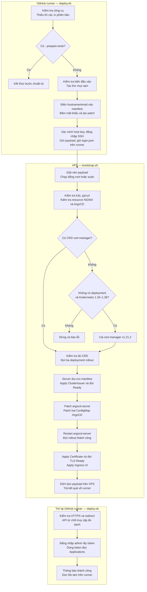

# ArgoCD UI - Bootstrap bằng GitHub Actions và SSH

Workflow: [Bootstrap ArgoCD UI](../../../.github/workflows/bootstrap-argocd.yml). Địa chỉ truy cập sau triển khai là `https://<ARGOCD_HOSTNAME>`, đăng nhập bằng `admin` và mật khẩu trong GitHub Secret `ARGOCD_ADMIN_PASSWORD`. Grafana để sau.

Tài liệu này mô tả cấu hình cần chạy; commit file chưa xác nhận VPS đã triển khai.

---

## Mục lục

- [Variables/Secrets có dùng trong manifest được không?](#variablessecrets-có-dùng-trong-manifest-được-không)
- [Cấu hình trên GitHub](#cấu-hình-trên-github)
- [DNS và điều kiện VPS](#dns-và-điều-kiện-vps)
- [Cách đọc và chạy hai script](#cách-đọc-và-chạy-hai-script)
- [Luồng triển khai ArgoCD UI](#luồng-triển-khai-argocd-ui)
- [Pipeline chạy thế nào?](#pipeline-chạy-thế-nào)
- [Ý nghĩa manifest và các thuật ngữ security](#ý-nghĩa-manifest-và-các-thuật-ngữ-security)
- [Vận hành và xử lý lỗi](#vận-hành-và-xử-lý-lỗi)

---

## Variables/Secrets có dùng trong manifest được không?

Có, thông qua runner: GitHub Actions → biến môi trường → render manifest tạm → SSH → `kubectl apply` trên VPS. Kubernetes và ArgoCD **không tự thay** `${{ vars.NAME }}` hoặc `${{ secrets.NAME }}` trong YAML ứng dụng.

`k8s/cert-manager-issuer.yaml`, `certificate.yaml`, `ingress.yaml` trong Git chỉ chứa giá trị giả `acme@example.invalid` và `argocd.example.invalid`. Không apply trực tiếp các file này. `deploy.sh` kiểm tra đầu vào rồi thay placeholder. Mật khẩu không nằm trong manifest Git; runner băm bcrypt và tạo một merge patch riêng cho Secret.

GitHub Variables không mã hóa/che log như Secrets. Workflow hỗ trợ hostname ở Variables như cấu hình ban đầu và ưu tiên Secret cùng tên nếu có. `add-mask` che các log sau khi script bắt đầu; **không đảm bảo che phần environment được Actions in lúc khởi tạo step**. Muốn che hostname ngay từ đầu, chuyển/tạo `ARGOCD_HOSTNAME` trong Secrets, tương tự với email. Người có quyền sửa workflow hoặc truy cập runner vẫn có thể sử dụng Secrets; masking không thay thế kiểm soát quyền repository.

Hostname vẫn tồn tại trong Kubernetes, DNS và chứng chỉ. Chứng chỉ Let’s Encrypt cho hostname cụ thể còn xuất hiện trong Certificate Transparency công khai. Nếu từng commit domain/password, xóa khỏi file hiện tại không xóa lịch sử Git; mật khẩu từng lộ phải được đổi. Bộ này không thực hiện rewrite lịch sử Git.

---

## Cấu hình trên GitHub

Vào **Settings → Secrets and variables → Actions**:

| Tên                     | Loại                                             | Giá trị                                                       |
| ----------------------- | ------------------------------------------------ | ------------------------------------------------------------- |
| `ARGOCD_HOSTNAME`       | Variable đang có; Secret nếu muốn che log từ đầu | Hostname thực, chữ thường, không có `https://`, port hay path |
| `ARGOCD_ADMIN_PASSWORD` | Secret đang có                                   | Mật khẩu mạnh, 16–72 byte UTF-8, không xuống dòng             |
| `ACME_EMAIL`            | Variable hoặc Secret                             | Email nhận thông báo tài khoản ACME                           |
| `VPS_SSH_HOST`          | Secret                                           | IP hoặc hostname VPS, không có port                           |
| `VPS_SSH_USER`          | Variable                                         | Username SSH: `root` hoặc user có `sudo -n`                   |
| `VPS_SSH_PASSWORD`      | Secret                                           | Mật khẩu đăng nhập SSH của user, không xuống dòng             |
| `VPS_SSH_KNOWN_HOSTS`   | Secret                                           | Dòng known_hosts đã xác minh của VPS                          |
| `VPS_SSH_PORT`          | Variable tùy chọn                                | Mặc định `22`                                                 |

Workflow đăng nhập SSH bằng **username/password**, không cần `VPS_SSH_KEY` hay thêm public key vào `authorized_keys`. Username lấy từ Variables; IP và mật khẩu lấy từ Secrets. Nếu trước đây đã lưu username trong Secret, chuyển giá trị đó sang Variable `VPS_SSH_USER`. `VPS_SSH_PASSWORD` là mật khẩu VPS, độc lập với mật khẩu UI trong `ARGOCD_ADMIN_PASSWORD`.

Runner dùng `sshpass -f` đọc mật khẩu từ file tạm chỉ user runner đọc được; không đặt mật khẩu SSH vào command-line hoặc payload tar. Dữ liệu tar vẫn truyền qua stdin của SSH. VPS phải cho phép password authentication đối với user đã chọn; pipeline không tự thay đổi cấu hình sshd. Nếu dùng `root`, server phải cho phép root đăng nhập bằng mật khẩu. User khác root vẫn cần `sudo -n` để bootstrap; mật khẩu SSH không tự được dùng cho sudo.

User cần đủ quyền bootstrap cụm. Quyền `contents: read` chỉ giới hạn GitHub token, không giới hạn quyền SSH/Kubernetes. Bảo vệ branch `main` và quyền sửa workflow tương ứng.

Để tạo known_hosts, lấy host public key qua console VPS hoặc phiên SSH đã tin cậy:

```bash
sudo cat /etc/ssh/ssh_host_ed25519_key.pub
sudo ssh-keygen -lf /etc/ssh/ssh_host_ed25519_key.pub
```

Đây là **public key của server** để xác minh đúng VPS; đăng nhập bằng password vẫn cần `VPS_SSH_KNOWN_HOSTS`, không cần private key của user. Ghép thành `VPS_HOST ssh-ed25519 AAAA...` trong Secret. Với port khác 22: `[VPS_HOST]:PORT ssh-ed25519 AAAA...`. Host phải khớp `VPS_SSH_HOST`. Nếu dùng `ssh-keyscan` từ máy cá nhân, đối chiếu fingerprint với console trước khi lưu. Pipeline dùng `StrictHostKeyChecking=yes`, không tự tin kết quả keyscan mới.

---

## DNS và điều kiện VPS

- Record A của hostname phải trỏ VPS. DNS only là cách mặc định; không để AAAA trỏ origin IPv6 không phục vụ domain. Giữ cổng 80/443 mở tới NGINX cho cả cấp mới và gia hạn HTTP-01; pipeline không sửa DNS/firewall.
- Nếu giữ Cloudflare proxy: Full (strict) cho hostname, không Flexible. Cho phép `/.well-known/acme-challenge/*` tới solver, không chặn bằng WAF/Access hoặc cache. Bỏ cache UI/API. Không đổi cả zone nếu website khác còn phụ thuộc Flexible.
- Runner GitHub-hosted phải SSH được tới VPS. Nếu firewall giới hạn SSH theo IP, dùng runner có địa chỉ egress được cho phép hoặc đường mạng quản trị phù hợp.
- VPS Linux Debian/Ubuntu có Bash, `tar`, k3s và kubeconfig `/etc/rancher/k3s/k3s.yaml`. Script dùng kubeconfig **trên VPS**, không xuất ra GitHub. Nếu thiếu `jq`/`curl`, script cài bằng apt. User khác root cần `sudo -n`.
- ArgoCD và NGINX đã chạy: namespace `argocd`, IngressClass `nginx` thuộc `k8s.io/ingress-nginx`, Service `argocd-server` dạng ClusterIP có port 443.
- Nếu chưa cài cert-manager, pipeline cài manifest release **v1.21.2**. Đối chiếu [phiên bản Kubernetes được hỗ trợ](https://cert-manager.io/docs/releases/) trước lần chạy đầu. Nếu đã cài, pipeline kiểm tra rollout trong namespace `cert-manager`, không nâng cấp bản cài đó. Nếu bản cài dùng tên/namespace tùy chỉnh, chỉnh bước này theo thực tế. Pipeline render và apply `k8s/cert-manager-issuer.yaml` để tạo hai ClusterIssuer dùng chung trên cụm VPS: `letsencrypt-staging` để thử nghiệm, `letsencrypt-prod` cho chứng chỉ thật.

ArgoCD tham chiếu `letsencrypt-prod`; Grafana sau này có thể dùng cùng ClusterIssuer nhưng vẫn tạo Certificate và TLS Secret riêng trong namespace của Grafana. ClusterIssuer không dùng xuyên giữa VPS và homelab. Email/solver trong file chung ảnh hưởng các dịch vụ sử dụng issuer đó trên cụm, nên quản lý thay đổi tại một nguồn này. Bản băm mật khẩu, TLS Secret và RBAC ArgoCD vẫn độc lập với các dịch vụ khác. `letsencrypt-staging` không liên quan môi trường staging của ứng dụng; chứng chỉ do ACME staging cấp không được trình duyệt tin cậy.

---

## Cách đọc và chạy hai script

Hai script chạy **từ trên xuống, không có hàm tự định nghĩa**. Mỗi khối lệnh có comment đánh số:

- `deploy.sh` chạy trên runner: kiểm tra/cài công cụ thiếu → đọc Variables/Secrets → tạo manifest và patch tạm → gửi qua SSH → kiểm tra HTTPS và đăng nhập.
- `bootstrap.sh` chạy trên VPS: kiểm tra k3s → kiểm tra/cài jq và curl → `k3s kubectl get` resource → chuẩn bị cert-manager → dry-run → `patch` → restart → apply Certificate/Ingress.

Kiểm tra công cụ bằng `command -v`; chỉ khi chưa có mới chạy `apt-get install --no-upgrade`. Công cụ đã có được giữ nguyên và in `--version` để xem trong log. Không còn hàm phân tích/so sánh phiên bản chung. Script dùng `k3s kubectl` có sẵn, không cài kubectl riêng hay cài lại cụm. Runner Ubuntu cần curl hỗ trợ `--retry-all-errors` (7.71 trở lên).

cert-manager đã có thì kiểm tra CRD, deployment và rollout; thiếu một phần sẽ dừng trước bước patch. Chỉ khi chưa có cả CRD và deployment mới cài v1.21.2, với điều kiện Kubernetes 1.33–1.36 theo [bảng hỗ trợ](https://cert-manager.io/docs/releases/). Với bản cert-manager có sẵn, version image hiện trong `get deployments -o wide`; server dry-run kiểm tra manifest có được API chấp nhận hay không.

Workflow vẫn gọi `bash k8s/argocd/ui/deploy.sh --prepare-tools` trước khi truyền Secrets. Khi chạy đầy đủ, script kiểm tra lại công cụ; nếu đã đủ thì không gọi apt.

Để đọc/chạy thủ công trên VPS, dùng payload **đã render**, gồm `bootstrap.sh`, `cluster-issuers.yaml`, `certificate.yaml`, `ingress.yaml`, `password.json`, `cm.json`, `params.json`. Không dùng YAML placeholder trực tiếp:

```bash
sudo bash /duong/dan/payload/bootstrap.sh /duong/dan/payload
```

Nếu muốn copy từng khối lệnh trong `bootstrap.sh`, mở root shell, đặt hai biến dưới đây rồi chạy các khối đánh số theo thứ tự. Kiểm tra kết quả mỗi khối trước khi chạy khối tiếp theo:

```bash
sudo -i
work=/duong/dan/payload
export KUBECONFIG=/etc/rancher/k3s/k3s.yaml
```

Các lệnh Kubernetes hiển thị trạng thái resource bình thường. Riêng patch mật khẩu ghi output vào file tạm để lỗi API không làm lộ hash. Payload được workflow xóa sau khi chạy; khi tự chuẩn bị payload thủ công, chỉ cho root đọc và tự dọn các file nhạy cảm sau khi hoàn tất.

---

## Luồng triển khai ArgoCD UI

[deploy.sh](deploy.sh) chạy trên **GitHub runner**, gửi payload qua SSH và gọi [bootstrap.sh](bootstrap.sh) trên **VPS**. Khi bootstrap hoàn tất, runner tiếp tục kiểm tra URL public. Hai script thực hiện một luồng duy nhất:

1. **Runner chuẩn bị:** kiểm tra/cài công cụ thiếu và in phiên bản. Với `--prepare-tools`, dừng tại đây. Khi chạy đầy đủ, kiểm tra Variables/Secrets do workflow truyền vào, tạo thư mục tạm, điền hostname/email vào manifest và tạo các patch. Mật khẩu UI được băm bcrypt; `login.json` chứa mật khẩu rõ chỉ giữ trên runner để kiểm tra đăng nhập.
2. **SSH sang VPS:** xác minh host key bằng `known_hosts`, đăng nhập bằng mật khẩu, gửi và giải nén payload. Chạy `bootstrap.sh` bằng root hoặc `sudo -n`, dùng kubeconfig `/etc/rancher/k3s/k3s.yaml`.
3. **VPS kiểm tra hạ tầng:** kiểm tra k3s, jq/curl, NGINX và ArgoCD; chỉ cài jq/curl nếu thiếu. Kiểm tra Service ClusterIP port 443 và flag/env xung đột. cert-manager đã có thì kiểm tra CRD/rollout; chưa có cả CRD lẫn deployment thì cài v1.21.2 sau khi xác nhận Kubernetes 1.33–1.36. Bản cài thiếu một phần sẽ dừng trước khi patch.
4. **VPS áp dụng cấu hình:** server dry-run manifest → apply ClusterIssuer dùng chung và đợi Ready → merge patch mật khẩu, URL/auth và đường dẫn vào Secret/ConfigMap → restart ArgoCD → apply Certificate, đợi TLS Ready → apply Ingress UI. Giữ RBAC, SSO và các key khác. HTTP-01 dùng Ingress solver riêng trong lúc cấp chứng chỉ.
5. **Runner xác minh:** kiểm tra HTTPS hợp lệ, HTTP chuyển sang HTTPS, API ẩn danh trả 401/403, đăng nhập admin và dùng token đọc Applications. Sau đó thông báo thành công và dọn file tạm.



Các bước chờ có giới hạn: rollout cert-manager/ArgoCD 180 giây mỗi deployment, ClusterIssuer Ready 120 giây, Certificate Ready 300 giây. Nếu lệnh bắt buộc hoặc phép kiểm tra thất bại, script dừng; **không tự rollback** các thay đổi trước đó và không xóa Ingress đã có. `trap` của `deploy.sh` dọn file tạm trên runner và trong phiên SSH khi thoát thông thường; chạy `bootstrap.sh` thủ công thì cần tự dọn payload.

---

## Pipeline chạy thế nào?

Sau khi thay đổi được đưa vào `main`, workflow chạy khi file bootstrap/manifest liên quan thay đổi. Cũng có thể vào **Actions → Bootstrap ArgoCD UI → Run workflow**, chọn `main`. Không chạy deploy trên pull request hoặc branch khác. Chỉnh Secrets/Variables không tự kích hoạt pipeline; dùng Run workflow để áp dụng giá trị mới. Concurrency không hủy lượt đang chạy giữa chừng khi lượt mới được gửi.

Thứ tự triển khai được mô tả trong [luồng triển khai ở trên](#luồng-triển-khai-argocd-ui). Sau pipeline, kiểm tra thủ công trình duyệt tải JS/CSS, refresh URL sâu và quyền truy cập của tài khoản hạn chế.

Payload và login response/token chỉ nằm trong thư mục tạm riêng; không upload artifact, không in response nhạy cảm. Trap dọn file tạm sau thành công/lỗi thông thường. Khi máy mất điện hoặc process bị SIGKILL, trap có thể không chạy; admin VPS có thể cần dọn thư mục `/tmp/argocd-bootstrap.*` còn sót sau khi xác minh.

Mỗi lần chạy đặt lại mật khẩu theo Secret và đổi `admin.passwordMtime`, có thể làm phiên đăng nhập cũ hết hiệu lực. Pod restart không đổi mật khẩu. Muốn rotate: cập nhật Secret rồi Run workflow. Không có rollback tự động khi một bước thất bại; các bước trước vẫn có hiệu lực. Ingress có sẵn từ lượt trước không bị xóa nếu lượt mới lỗi. Nếu Helm/GitOps quản lý chính ConfigMap ArgoCD, phải đưa các key này vào source/values của bản cài đó để reconcile không ghi đè.

Nếu đã chạy bản cũ dùng Issuer riêng `argocd-letsencrypt`, chạy lại pipeline để chuyển Certificate sang ClusterIssuer. Pipeline không tự xóa Issuer/ACME Secret cũ; chỉ dọn sau khi xác nhận Certificate mới đã cấp thành công bằng `letsencrypt-prod` và không Certificate nào còn tham chiếu Issuer cũ.

---

## Ý nghĩa manifest và các thuật ngữ security

| Trường/thuật ngữ                            | Ý nghĩa trong cấu hình này                                                                                                                                                              |
| ------------------------------------------- | --------------------------------------------------------------------------------------------------------------------------------------------------------------------------------------- |
| `apiVersion`, `kind`                        | Chọn API và loại tài nguyên: Ingress chuẩn Kubernetes, ClusterIssuer/Certificate do cert-manager bổ sung                                                                                |
| CRD / controller                            | CRD đăng ký loại tài nguyên mới; controller theo dõi và thực hiện yêu cầu. Cần cài cert-manager trước ClusterIssuer/Certificate                                                         |
| `metadata.name`                             | Tên resource để các resource khác tham chiếu                                                                                                                                            |
| `metadata.namespace: argocd`                | Ingress, Service, Certificate và TLS Secret ArgoCD cùng namespace. ClusterIssuer không có namespace. Namespace không tự cách ly mạng                                                    |
| `metadata.annotations`                      | Chỉ dẫn bổ sung cho NGINX, không phải policy phân quyền Kubernetes                                                                                                                      |
| `spec`                                      | Trạng thái mong muốn; controller cập nhật trạng thái thực tế vào `status`                                                                                                               |
| Issuer / ClusterIssuer                      | Issuer chỉ dùng trong một namespace; ClusterIssuer dùng chung giữa các namespace của cùng cluster                                                                                       |
| `acme.server` / `email`                     | Endpoint ACME Let’s Encrypt staging/production và email lấy từ `ACME_EMAIL`                                                                                                             |
| `privateKeySecretRef.name`                  | Secret giữ private key **tài khoản ACME**, khác private key TLS của website. Với ClusterIssuer, mặc định nằm trong namespace `cert-manager` (cluster resource namespace của controller) |
| `solvers.http01`                            | Chứng minh quyền kiểm soát domain bằng HTTP challenge qua cổng 80                                                                                                                       |
| `ingressClassName: nginx`                   | Giao Ingress UI/solver cho ingress-nginx xử lý                                                                                                                                          |
| Certificate `dnsNames`                      | Hostname phải có trong chứng chỉ và được CA xác minh                                                                                                                                    |
| `issuerRef`                                 | Tham chiếu `letsencrypt-prod`, loại `ClusterIssuer`, API group `cert-manager.io`                                                                                                        |
| Certificate `secretName`                    | Secret đích chứa `tls.crt` và `tls.key` do cert-manager quản lý                                                                                                                         |
| `privateKey.rotationPolicy: Always`         | Thay private key khi cấp lại chứng chỉ; cert-manager tự lo gia hạn                                                                                                                      |
| Ingress `tls.hosts`, `tls.secretName`       | Gắn hostname với chứng chỉ NGINX trình cho trình duyệt                                                                                                                                  |
| `rules.host`                                | Chỉ route request có Host tương ứng tới ArgoCD                                                                                                                                          |
| `path: /`, `pathType: Prefix`               | Route mọi đường dẫn dưới gốc; không rewrite nên UI/API/assets cùng origin                                                                                                               |
| `backend.service.name`, `port.number: 443`  | Service nội bộ đích, không phải port công khai mới của VPS                                                                                                                              |
| `backend-protocol: HTTPS`                   | NGINX nói HTTPS với ArgoCD; không tự bật xác minh chứng chỉ upstream/mTLS                                                                                                               |
| `ssl-redirect`, `force-ssl-redirect`        | Yêu cầu chuyển HTTP sang HTTPS tại Ingress UI                                                                                                                                           |
| `proxy-read-timeout: 600`                   | Thời gian chờ đọc upstream cho request dài; không phải timeout phiên đăng nhập                                                                                                          |
| TLS                                         | Mã hóa đường truyền và xác minh danh tính server. Browser xác minh chứng chỉ CA; không thay thế đăng nhập                                                                               |
| ClusterIP                                   | Service nội bộ; UI được công khai qua Ingress thay vì mở thêm NodePort                                                                                                                  |
| Authentication / Authorization              | Xác thực: bạn là ai. Phân quyền: bạn được làm gì sau đăng nhập                                                                                                                          |
| RBAC                                        | Phân quyền theo vai trò. ArgoCD RBAC và Kubernetes RBAC là hai lớp khác nhau; pipeline giữ policy hiện hữu                                                                              |
| ConfigMap                                   | Cấu hình không bí mật như URL/auth toggle; không chứa plaintext password                                                                                                                |
| Kubernetes Secret                           | Resource chứa dữ liệu nhạy cảm; base64 không phải mã hóa. Quyền API và mã hóa datastore vẫn cần được quản trị riêng                                                                     |
| `admin.password`                            | Bản băm bcrypt, không thể giải mã thành mật khẩu; ArgoCD so sánh khi đăng nhập                                                                                                          |
| `admin.passwordMtime`                       | Thời điểm đổi mật khẩu, dùng khi kiểm tra hiệu lực phiên/token admin                                                                                                                    |
| `url`                                       | URL bên ngoài để tạo liên kết và xử lý luồng đăng nhập                                                                                                                                  |
| `admin.enabled: true`                       | Cho phép tài khoản admin tích hợp (quyền quản trị), không cho phép khách đăng nhập tự do                                                                                                |
| `users.anonymous.enabled: false`            | Không cấp quyền default role cho người chưa đăng nhập                                                                                                                                   |
| `server.insecure: false`                    | Server ArgoCD tiếp tục phục vụ TLS phía sau NGINX                                                                                                                                       |
| `server.rootpath: ""`, `server.basehref: /` | Chạy tại gốc hostname, tránh tải asset hoặc chuyển hướng vào subpath cũ                                                                                                                 |
| Merge patch                                 | Chỉ đổi key được gửi; giữ các key khác trong Secret/ConfigMap                                                                                                                           |
| SSH host key                                | Xác minh đang kết nối đúng VPS; mật khẩu trong `VPS_SSH_PASSWORD` dùng để xác thực user đăng nhập                                                                                          |

Domain thật bắt buộc có trong cấu hình runtime để định tuyến và cấp TLS. Giấu domain khỏi Git không chặn truy cập Internet; muốn UI riêng tư cần VPN, allowlist hoặc lớp kiểm soát truy cập phù hợp, đồng thời giữ auth/RBAC ArgoCD.

---

## Vận hành và xử lý lỗi

Thông báo pipeline chỉ nêu giai đoạn và không in response chứa hash/token. Đọc trạng thái tại VPS; không đưa `get secret -o yaml` hoặc login response vào log CI:

```bash
sudo k3s kubectl get clusterissuer letsencrypt-staging letsencrypt-prod
sudo k3s kubectl -n argocd get ingress,certificate
sudo k3s kubectl -n argocd describe certificate argocd-ui-tls
sudo k3s kubectl -n argocd get orders,challenges
sudo k3s kubectl -n argocd get events --sort-by=.lastTimestamp
sudo k3s kubectl -n cert-manager get deployments
```

**Các lỗi thường gặp:**

- **SSH lỗi:** kiểm tra host/user/password, server cho phép password authentication, known_hosts (gồm port) và `sudo -n` nếu user không phải root. Đổi mật khẩu VPS thì cập nhật lại Secret `VPS_SSH_PASSWORD` trước khi chạy pipeline.
- **Khối 3 — kiểm tra ArgoCD:** kiểm tra flag `--insecure`, `--disable-auth`, rootpath/basehref hoặc env ghi đè trực tiếp; chỉnh source bản cài trước khi chạy lại.
- **Khối 4–5 — cert-manager/dry-run:** kiểm tra version, CRD, webhook/rollout.
- **Khối 6 — ClusterIssuer:** kiểm tra `kubectl describe clusterissuer letsencrypt-prod`, email ACME và kết nối từ cert-manager tới ACME server. Lỗi bước này chưa đổi mật khẩu.
- **Khối 8 — Certificate:** kiểm tra A/AAAA, port 80, CAA cho phép `letsencrypt.org`, Cloudflare/WAF. Giữ đường challenge hoạt động cho những lần gia hạn sau.
- **502:** kiểm tra endpoint Service và backend HTTPS.
- **Redirect loop:** kiểm tra Cloudflare Flexible.
- **Certificate giả NGINX:** kiểm tra TLS Secret và Ready.
- **Login fail:** xác minh Secret password mới, ConfigMap auth và Cloudflare không cache/chặn API. Không tắt kiểm tra TLS để làm pipeline xanh.

Sau pipeline thành công, mở UI ở cửa sổ riêng tư và đăng nhập. Với CLI:

```bash
argocd login "$ARGOCD_HOSTNAME" --username admin --grpc-web
```

Nếu dùng SSO, sửa callback ở OAuth provider cho hostname mới:

- Dex: `https://<hostname>/api/dex/callback`
- OIDC trực tiếp: `https://<hostname>/auth/callback`

Sau khi xác nhận mật khẩu mới hoạt động, có thể xóa Secret bootstrap cũ:

```bash
sudo k3s kubectl -n argocd delete secret argocd-initial-admin-secret --ignore-not-found
```

Để đóng UI public và quay về port-forward, giữ nguyên mật khẩu mới:

```bash
sudo k3s kubectl -n argocd delete ingress argocd-ui --ignore-not-found
sudo k3s kubectl -n argocd port-forward svc/argocd-server 8080:443
```

Port-forward trên VPS chỉ nghe localhost VPS; từ máy cá nhân mở tunnel:

```bash
ssh -L 8080:127.0.0.1:8080 USER@VPS_HOST
```

Rồi truy cập `https://localhost:8080` (chứng chỉ nội bộ không khớp localhost). Lượt pipeline tiếp theo sẽ tạo lại Ingress; tạm disable workflow nếu cần giữ trạng thái đóng. Không xóa cert-manager dùng chung.

---

## Tham khảo

- [GitHub Variables](https://docs.github.com/en/actions/how-tos/write-workflows/choose-what-workflows-do/use-variables)
- [GitHub Secrets](https://docs.github.com/en/actions/how-tos/write-workflows/choose-what-workflows-do/use-secrets)
- [Kubernetes Secrets](https://kubernetes.io/docs/concepts/configuration/secret/)
- [ArgoCD Ingress](https://argo-cd.readthedocs.io/en/stable/operator-manual/ingress/)
- [cert-manager installation](https://cert-manager.io/docs/installation/kubectl/)
- [Certificate Transparency](https://letsencrypt.org/docs/ct-logs/)
