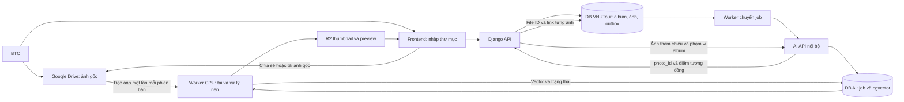

# Kế hoạch gallery sự kiện và tìm ảnh theo khuôn mặt

Ngày: 2026-09-22. Trạng thái: kế hoạch, chưa thay đổi ứng dụng hoặc hạ tầng. Flow đã thống nhất: BTC nhập link thư mục Google Drive vào VNUTour; hệ thống tải và xử lý nền trên server, lưu preview trên R2 và link Drive của từng ảnh để chia sẻ/tải xuống. GPU batch là phương án mở rộng tùy chọn sau benchmark CPU.

## 1. Mục tiêu và quyết định ban đầu

Người dùng xem album công khai, gửi một ảnh chân dung và nhận các ảnh sự kiện có khuôn mặt tương ứng. BTC upload nhiều ảnh lên Google Drive, nhập thư mục vào hệ thống, theo dõi tiến độ và xuất bản album. Kho ảnh có thể vượt vài chục GB.

- Google Drive giữ ảnh gốc; Cloudflare R2 Standard chỉ giữ thumbnail/preview. Service AI chạy bằng Deployment/Service trong Kubernetes hiện có, xử lý import và ảnh tham chiếu trên CPU; không tạo VM riêng cho AI.
- Quyết định quyền truy cập mới: gallery/tìm ảnh chỉ dành cho tài khoản thành viên đội đã được duyệt, admin/master_admin và coop (`collab`). API kiểm tra mỗi request; quản trị album chỉ dành cho admin. Ảnh nguồn/preview vẫn theo quyền public của Drive/R2; “public gallery” trong các phần thiết kế dưới đây được hiểu là album đã xuất bản dành cho nhóm được phép này.
- Backend VNUTour quản lý album, quyền BTC, metadata và trạng thái công khai.
- Service AI quản lý mô hình, xử lý nền và chỉ mục khuôn mặt. Không cần lưu thêm toàn bộ ảnh gốc lâu dài.
- Gallery dùng được khi AI chưa xử lý xong hoặc tạm ngừng phục vụ.
- Pipeline thử nghiệm ưu tiên: YuNet phát hiện/căn chỉnh khuôn mặt + SFace tạo embedding trên CPU. Nếu thêm GPU sau này phải giữ pipeline tương thích; chốt bản production sau G0.
- Không cần vận hành vector database chuyên biệt như Qdrant/Milvus. Đề xuất PostgreSQL + extension pgvector cho dữ liệu AI, dùng exact search trước và HNSW nếu benchmark cho thấy cần.
- Ảnh tham chiếu là đầu vào tìm kiếm, không phải bằng chứng xác thực danh tính. Không gắn kết quả với tên, MSSV hoặc tài khoản.

Giả định để lập kế hoạch: gallery và tìm kiếm mở công khai; chỉ BTC được upload/xóa/xuất bản. Tìm kiếm có giới hạn kích thước, tần suất và số request đang xử lý. Có thể chuyển tìm kiếm sang yêu cầu đăng nhập bằng cấu hình nếu cần.

Ngoài MVP: video, nhận diện người quay lưng/che kín mặt, tự gom và đặt tên người, nhiều ảnh tham chiếu một lúc, tải cả album dạng ZIP, upload vào Drive ngay từ UI VNUTour và huấn luyện mô hình riêng. MVP dùng giao diện/ứng dụng Drive sẵn có để BTC upload.

### Luồng sản phẩm đã chốt

1. BTC tạo/chọn album, dán link thư mục Drive rồi bấm **Nhập và xử lý**.
2. Hệ thống xác minh quyền đọc, liệt kê ảnh và tạo phiên import chạy nền; BTC có thể đóng trang mà tác vụ vẫn tiếp tục.
3. Worker lần lượt tải ảnh gốc về thư mục tạm, tạo preview/thumbnail, tìm khuôn mặt và lưu embedding. Không tải cả album vào RAM.
4. Mỗi ảnh lưu Drive file ID, link xem/chia sẻ và link tải do API cung cấp, cùng preview R2 và trạng thái xử lý.
5. Gallery và kết quả tìm kiếm có **Xem ảnh**, **Sao chép link Drive**, **Mở/tải ảnh gốc trên Drive**. Tải gốc không đi qua Django trong MVP.
6. Thêm ảnh vào thư mục rồi bấm **Đồng bộ lại**: chỉ xử lý ảnh mới/đổi nội dung; import trùng không tạo ảnh trùng.

Link thư mục là đầu vào của BTC; hệ thống vẫn cần kết nối Drive phía server được thiết lập một lần. Không yêu cầu BTC dán link từng ảnh. Việc xuất bản gallery không tự sửa quyền chia sẻ của thư mục Drive.

## 2. Cơ sở từ repository

| Thành phần hiện tại | Cách sử dụng trong tính năng mới |
| --- | --- |
| `backend/webapi/api/models.py`: `FeedPost`, `FeedImage` | Tham khảo metadata; tạo model gallery riêng vì vòng đời album khác bài viết |
| `backend/webapi/api/services/submission_storage_service.py` | Tận dụng cách cấu hình và tạo client R2; tách helper dùng chung nếu cần |
| `backend/webapi/api/services/feed_service.py` | Giữ nguyên luồng feed; gallery nhập metadata từ Drive và dùng R2 cho derivatives, không fallback lưu toàn kho ảnh trên pod |
| `backend/webapi/api/views_feed.py` | Feed đang kiểm tra thành viên/đội; không mở quyền feed khi thêm gallery công khai |
| `frontend/src/FeedImageCarousel.jsx` | Xem xét tái sử dụng phần hiển thị ảnh phù hợp |
| `k8s/kustomize/`, `k8s/KUSTOMIZE_GUIDE.vi.md` | Bổ sung component cấu hình kết nối AI theo overlay; không lấy Compose cũ làm production mặc định |

Đây là khảo sát mã nguồn và tài liệu, chưa xác minh tài nguyên thực tế của cluster. Các thay đổi khác đang có trong working tree không thuộc kế hoạch này.

## 3. Kiến trúc đề xuất

### Ranh giới triển khai

- Đề xuất một service Python HTTP, có thể dùng FastAPI; image và dependencies riêng với Django. Mã nguồn dự kiến ở `services/photo-ai/`, có thể chuyển sang repository riêng mà giữ nguyên API.
- Hai tiến trình từ cùng codebase: API phục vụ tìm kiếm và worker xử lý hàng loạt. Có giới hạn concurrency/tài nguyên riêng, tránh lập chỉ mục chiếm hết tài nguyên tìm kiếm.
- MVP xử lý toàn bộ import bằng worker CPU có giới hạn tài nguyên. Batch GPU/export-import là phương án mở rộng nếu benchmark cho thấy CPU không đáp ứng thời gian xử lý album.
- AI có PostgreSQL + pgvector riêng về quyền sở hữu dữ liệu, migrations và credentials. Ưu tiên database/user riêng trên PostgreSQL của cluster hiện có nếu tương thích và còn tài nguyên; nếu cần instance riêng thì vẫn triển khai trong Kubernetes. Đo ảnh hưởng I/O, RAM và CPU lên database sự kiện.
- Extension pgvector là lựa chọn lưu/truy vấn vector trong PostgreSQL, không phải một service mới cần GPU. Nếu không cài được extension, G0 có thể so cosine bằng NumPy trên snapshot vector; production vẫn phải xử lý cập nhật/xóa/đồng bộ snapshot. Không tự thêm hệ thống vector chuyên biệt chỉ vì dung lượng ảnh gốc lớn.
- MVP dùng bảng job bền vững trong DB AI với lease, heartbeat và retry. Outbox trong DB Django đảm bảo giao job sau commit. Chưa thêm Redis/Celery khi chưa có nhu cầu đo được.
- AI chỉ nhận request từ backend/worker đã xác thực qua mạng nội bộ hoặc kết nối TLS được bảo vệ. Trình duyệt không gọi AI trực tiếp.
- Input indexing là `drive_file_id` đã được backend đối chiếu trong thư mục cấu hình và source revision, không phải URL tùy ý. Credentials Drive chỉ nằm phía server; quyền R2 giới hạn theo bucket và nhiệm vụ.

### Mô hình và tài nguyên CPU

- YuNet: phát hiện vị trí mặt và landmarks; SFace: căn chỉnh theo landmarks rồi tạo vector nhận diện. OpenCV Zoo có pipeline tích hợp và target CPU. [Demo chính thức](https://huggingface.co/opencv/face_recognition_sface/blob/main/demo.py)
- Baseline dùng `face_detection_yunet_2023mar.onnx` + `face_recognition_sface_2021dec.onnx` với OpenCV 4.x đã pin version/checksum. Kiểm tra shape output khi khởi động, không suy ra dimension chỉ từ tên kiến trúc.
- Benchmark FP32 trước, sau đó thử SFace INT8 nếu chậm. INT8 chỉ được chọn khi cải thiện tốc độ trên CPU thật và đạt chất lượng; đổi trọng số/pipeline phải tạo model version riêng và reindex.
- OpenCV Zoo công bố YuNet theo MIT, SFace theo Apache-2.0 cho toàn bộ file trong từng thư mục. Lưu license cùng artifact; hiện có câu hỏi upstream chưa được giải đáp về nguồn dữ liệu/quyền trọng số SFace, nên không ghi nhận “đã xác minh mọi quyền sử dụng” chỉ từ tên license. [YuNet](https://github.com/opencv/opencv_zoo/blob/main/models/face_detection_yunet/README.md), [SFace](https://github.com/opencv/opencv_zoo/blob/main/models/face_recognition_sface/README.md), [issue làm rõ nguồn trọng số](https://github.com/opencv/opencv_zoo/issues/313).
- Không mặc định dùng pretrained InsightFace: giấy phép public weights giới hạn nghiên cứu phi thương mại. Chỉ so sánh pipeline thay thế khi quyền sử dụng phù hợp.
- Worker batch khởi đầu concurrency 1, pin số thread OpenCV/BLAS để không làm nghẽn máy. API search có pool/tài nguyên riêng; tăng concurrency theo benchmark, không tạo nhiều process khiến mỗi process chiếm toàn bộ lõi.
- Đọc ảnh gốc đủ rõ, thử resize có kiểm soát và tiles chồng lấn với ảnh nhóm rất lớn; đo riêng tỷ lệ bỏ sót mặt nhỏ và chi phí CPU. Chưa hứa latency hoặc thời gian xử lý toàn bộ trước khi benchmark trong Pod với giới hạn tài nguyên thực tế.

### Cấu hình triển khai trong Kubernetes hiện có

Người dùng xác nhận host dùng Intel Core i5-13400F, còn khoảng 10 cores khả dụng và ngân sách RAM 6 GB; không có GPU. Service phải nằm trong cluster hiện có, không tạo VM riêng. Tài nguyên dư trên Proxmox không tự động bằng tài nguyên allocatable của node; trước triển khai kiểm tra capacity, requests đã cấp, usage và disk của từng node. Chưa đo mức tranh chấp với workload/VM khác.

- Thêm component dự kiến `k8s/kustomize/components/photo-ai/`, bật theo overlay staging/prod đang sử dụng; giữ convention namespace/image tag/secrets của repo, triển khai qua ArgoCD.
- `photo-ai-api`: Deployment 1 replica, giữ mô hình trong bộ nhớ để phục vụ truy vấn. Expose bằng ClusterIP Service `photo-ai`; Django gọi nội bộ, không cần Ingress/NodePort cho AI.
- `photo-ai-worker`: Deployment 1 replica, concurrency 1 khi bắt đầu, claim job bền vững từ DB. Restart hoặc rollout có lease/retry/idempotency để không mất tiến độ và không xử lý trùng kết quả.
- API và worker dùng cùng image/model version, khác entrypoint. Pin model checksum trong image/artifact và có startup/readiness probes khi model đã nạp; liveness kiểm tra tiến trình, tránh restart liên tục chỉ vì Drive/DB tạm lỗi.
- Credentials Drive, R2, DB và khóa API nội bộ đặt trong Secret; cấu hình không nhạy cảm trong ConfigMap. Model là tài nguyên chỉ đọc. File gốc tạm dùng disk-backed `emptyDir` có `sizeLimit` và ephemeral-storage requests/limits; không dùng RAM-backed volume cho ảnh gốc. [Kubernetes resource management](https://kubernetes.io/docs/concepts/configuration/manage-resources-containers/)
- Dự toán ban đầu, chưa phải manifest đã triển khai:

| Workload | CPU request / limit | RAM request / limit |
| --- | --- | --- |
| API, 1 replica | 500m / 2 CPU | 768Mi / 1536Mi |
| Worker, 1 replica | 1 / 3 CPU | 1Gi / 2Gi |

Tổng giới hạn RAM hai workload là 3,5 GiB; còn phải tính PostgreSQL tăng thêm, cache và dư địa node trong ngân sách khoảng 6 GB. Requests là đầu vào scheduling, không phải dự báo peak sử dụng. Điều chỉnh requests/limits theo RSS, CPU throttling và tải thật; không tăng replica tự động trong MVP.

- Rollout ban đầu tránh nhân đôi Pod vượt ngân sách: `maxSurge: 0`, `maxUnavailable: 1` hoặc chiến lược tương đương; chấp nhận gián đoạn search ngắn khi cập nhật, gallery vẫn hoạt động. Mở rộng khả năng rollout không gián đoạn sau khi có thêm headroom.
- PostgreSQL: kiểm tra image hiện tại có pgvector hay chưa; repo có cả `db-simple` và `db-patroni`. Nếu phải đổi image, bảo đảm extension có trên primary/replica và đường backup/restore, giữ phiên bản PostgreSQL tương thích. Không chỉ thêm `CREATE EXTENSION` khi binary chưa có, không tự thay database production để chạy benchmark.
- G0 chạy như Job Kubernetes trong namespace môi trường thử nghiệm với image dự kiến và CPU/RAM limit tương đương worker; chỉ cần công cụ benchmark, YuNet/SFace và cosine NumPy. Chưa cần nối Drive/R2 hay database production. Job có deadline, xuất báo cáo bền vững trước cleanup, TTL sau hoàn thành. Nếu sau này có GPU, so cùng tập ảnh qua hai backend trước khi import.
- Bắt đầu 1 worker xử lý ảnh, thử OpenCV 1/2/4 threads với BLAS giới hạn để đo cấu hình tốt nhất. Đọc lần lượt hoặc theo batch nhỏ; không decode cả album vào RAM.
- Với ảnh độ phân giải lớn, giới hạn cả số pixel lẫn số ảnh đang decode và kích thước tile; byte file nén không phản ánh RAM xử lý.
- Ghi peak RSS từng container, RAM khả dụng node, throttling/OOM/eviction và thời gian decode/detect/embed/search riêng. Chốt ngân sách theo dư địa cluster thực tế thay vì gán toàn bộ 6 GB cho một Pod.
- Khi chuyển thành service, bắt đầu 1 worker batch và 1 request inference search đang chạy; xếp hàng có giới hạn. Đo tải 1/2/5/10 client và p95 bao gồm thời gian chờ rồi mới tăng concurrency.
- Thử trước 200–500 ảnh cùng ảnh tham chiếu của 20–30 người, có người vắng mặt trong gallery; đây là vòng xác nhận pipeline. Sau đó mở rộng bộ độc lập 500–1.000 ảnh theo G0, không suy ra độ chính xác production từ tập thử nhỏ.

### Mở rộng tùy chọn: xử lý album trên GPU, phục vụ tìm kiếm trên CPU

Chỉ triển khai phần này nếu benchmark CPU không đáp ứng và người dùng chọn bổ sung máy GPU; không phải dependency của MVP. Việc tạo preview, decode và truyền file vẫn có chi phí CPU/I/O; đo toàn pipeline, không suy ra tốc độ tổng chỉ từ tốc độ inference GPU.

1. Máy batch đọc ảnh gốc từ Drive hoặc thư mục ảnh local đã ánh xạ với Drive file ID/revision. Với mỗi ảnh, tạo thumbnail/preview, phát hiện mặt, căn chỉnh và trích embedding; checkpoint để tiếp tục sau gián đoạn.
2. Xuất gói kết quả có manifest, bảng ảnh, bảng khuôn mặt và tensor embeddings. Định dạng đề xuất JSONL + NPZ không chứa pickle/object array. Mỗi ảnh gồm ID nguồn, content checksum, revision, key/checksum derivatives, số mặt và trạng thái thành công/no_faces/lỗi; mỗi mặt có bbox trong hệ tọa độ đã chuẩn hóa orientation và vector.
3. Manifest ghi schema version, job/batch ID, event/album ID, checksum trọng số detector/recognizer, pipeline version, kiểu chuẩn hóa, dimension, dtype, metric, runtime/backend và precision thực tế. Có checksum cho từng file gói kết quả.
4. Có thể đưa preview lên vùng staging R2 từ máy batch với quyền giới hạn, hoặc chuyển cùng gói kết quả để worker Kubernetes upload. Embeddings/manifest chuyển qua endpoint quản trị được xác thực hoặc storage riêng cho Job import; không đặt dưới bucket/domain preview public.
5. Job import trong cluster kiểm tra nguồn/revision hiện tại, file shape/kích thước/checksum, vector hữu hạn và chuẩn hóa, model version, ID ảnh và quyền sở hữu album trước khi nhập. Bỏ kết quả nguồn đã xóa/đổi hoặc bị tombstone, không tự phục hồi ảnh đã gỡ.
6. Import theo batch có checkpoint và khóa idempotency; ghi vào phiên bản staging, kiểm tra đủ dữ liệu trước khi chuyển active. Preview và vector lỗi không làm mất album/chỉ mục đang hoạt động. Bản không có mặt vẫn được hiển thị trong gallery.
7. Khi tìm kiếm, Pod API vẫn chạy detector + recognizer trên ảnh tham chiếu, rồi tra vector đã nhập. Không chạy nhận diện lại trên toàn bộ ảnh sự kiện và không gọi máy GPU.

Điều kiện tương thích: giữ cùng trọng số recognizer, quy tắc crop/landmarks, RGB/BGR, resize, chuẩn hóa và metric. G0 phải so điểm tương đồng, thứ hạng và quyết định qua ngưỡng giữa CPU/GPU trên cùng dữ liệu; không yêu cầu kết quả bitwise giống nhau. Không dùng mô hình lớn trên GPU để lập chỉ mục rồi dùng mô hình nhỏ khác trên CPU cho truy vấn. Nếu CPU cần model khác hoặc precision khác làm thay đổi chất lượng đáng kể thì chọn lại pipeline và reindex.

OpenCV Zoo có target CUDA bên cạnh CPU, nhưng build/runtime trên máy batch phải thực sự hỗ trợ GPU; xác minh backend và mức sử dụng GPU, không mặc định cài package Python là đã bật CUDA. Với FP16/INT8, đo sai khác với CPU FP32 trước khi cho phép import cùng model version. [Demo target CPU/CUDA](https://huggingface.co/opencv/face_recognition_sface/blob/main/demo.py)

Ảnh mới được xử lý bằng đợt GPU tiếp theo, hoặc bằng pipeline tương thích trên worker CPU khi số lượng nhỏ. Máy GPU có thể tắt sau khi export/import thành công. Phần nặng còn lại trên Pod API là ảnh tham chiếu và tìm vector; giới hạn concurrency CPU vẫn áp dụng.

## 4. Các luồng chính

### Nhập từ Google Drive và xuất bản

1. BTC upload bằng Google Drive vào thư mục sự kiện, sau đó nhập folder ID/link vào album nháp trong VNUTour. MVP một thư mục/album, liệt kê đầy đủ các trang kết quả; thư mục con phải được chọn rõ, bỏ qua shortcut để tránh nhập nhầm/vòng lặp.
2. Backend dùng Drive API đã xác thực để lấy ID, MIME, size, version, checksum nếu có, modified time, `webViewLink`, `webContentLink`, resource key nếu cần và quyền tải. Parse folder ID/resource key từ link, kiểm tra đúng tài nguyên thư mục được phép truy cập; không scrape giao diện hoặc tự chế URL download.
3. Tạo job cho file mới/đã đổi nội dung. Worker tải từng ảnh gốc vào bộ đệm tạm có giới hạn, kiểm tra metadata trước/sau tải và checksum; nếu nguồn đổi giữa chừng thì hủy kết quả cũ và retry phiên bản mới.
4. Trên cùng dữ liệu đã tải, xác minh/decode, chuẩn hóa EXIF orientation, tạo thumbnail/preview và embedding. Derivatives sẵn sàng có thể xuất bản trước khi bước embedding thành công; retry AI có thể cần đọc lại nguồn.
5. Chỉ derivatives lên R2: thumbnail đề xuất cạnh dài 400 px, preview 1.600–2.048 px; chất lượng/byte mục tiêu đo theo ảnh thật. Theo quyết định dùng chung bucket, derivatives nằm dưới prefix `event-photos/` trong `R2_BUCKET` hiện có. Draft/hidden được lọc tại API; quyền truy cập trực tiếp qua domain public theo bucket. AI không nhận diện từ preview đã nén nhỏ.
6. Sau xử lý, xóa file gốc tạm. Retry/reindex là trường hợp được đọc lại Drive, không tải lại toàn bộ album khi người dùng search.

Trang tiến độ hiển thị số ảnh đã phát hiện, chờ, đang tải/xử lý, preview sẵn sàng, indexed, không có mặt và lỗi; ghi lý do lỗi từng file, hỗ trợ thử lại file lỗi. Ảnh không có mặt vẫn là ảnh hợp lệ trong gallery. Trạng thái xác minh quyền, import và xuất bản album được hiển thị riêng.

Không dùng `thumbnailLink` của Drive làm URL gallery lâu dài: Google mô tả đây là link ngắn hạn và không dành để nhúng trực tiếp trong web app. [Drive file metadata](https://developers.google.com/workspace/drive/api/guides/file-metadata)

MVP hỗ trợ JPEG, PNG và WebP; giới hạn đề xuất 30 MB/file, tối đa 60 megapixel, điều chỉnh bằng cấu hình sau thử nghiệm. Preview loại metadata vị trí; nút tải ảnh gốc qua Drive trả file gốc đúng như BTC đã upload, có thể còn EXIF. RAW/HEIC để giai đoạn sau.

### Quyền truy cập Drive và tải bản gốc

- MVP đọc nguồn: chia sẻ thư mục riêng cho service account nếu chính sách tài khoản cho phép; hoặc dùng OAuth của tài khoản BTC. Một link public không thay thế kết nối API/credentials ổn định phía server. Không tự mở public một folder ngoài phạm vi yêu cầu.
- Service account không có dung lượng để sở hữu file. Nếu sau này app upload hộ, phải dùng Shared Drive phù hợp hoặc OAuth thay mặt người dùng. MVP BTC upload bằng tài khoản sẵn có nên không cần service account sở hữu ảnh. [Google Drive shared drives](https://developers.google.com/workspace/drive/api/guides/about-shareddrives)
- BTC cấu hình quyền xem/tải ảnh gốc; kiểm tra đăng xuất vẫn truy cập được trước khi hiện nút public. Workspace có thể giới hạn chia sẻ ngoài tổ chức.
- Nút “Mở/tải ảnh gốc trên Drive” dùng link do Drive API trả (`webViewLink`/`webContentLink`, và resource key nếu áp dụng). MVP chấp nhận rời gallery sang Drive; không hứa một click tải file trong mọi trình duyệt. [Tải file](https://developers.google.com/workspace/drive/api/guides/manage-downloads)
- `drive_file_id` là khóa nguồn bền vững, không dùng filename/link làm khóa duy nhất. Lưu link xem/chia sẻ và link tải tách nhau, refresh metadata khi đồng bộ; không giả định link tải là vĩnh viễn hoặc bỏ qua quyền Drive. Nếu không có link tải hợp lệ thì chỉ hiện mở trên Drive và thông báo phù hợp.
- API có quota/rate limit; retry exponential backoff + jitter và báo tiến độ bị trì hoãn. Không dùng Drive phục vụ thumbnail hay đọc ảnh gốc cho mỗi lần search. Kiểm tra quota thực tế của Cloud project vì chính sách hiện hành có khác biệt giữa dự án cũ/mới. [Giới hạn Drive API](https://developers.google.com/workspace/drive/api/guides/limits)
- Nếu cần tải gốc ổn định ngay trong site ở tải cao, phải đánh giá thêm download gateway/cache hoặc chuyển nguồn sang object storage; đây không phải phần mặc định của MVP “R2 chỉ preview”.

### Lập chỉ mục AI

1. Job có khóa duy nhất `(photo_id, source_revision, model_version)`.
2. Worker nhận lease, đọc ảnh Drive tạm, phát hiện khuôn mặt, căn chỉnh và tạo embedding bằng pipeline CPU cố định; tái sử dụng lượt đọc tạo derivatives khi có thể.
3. Lưu các khuôn mặt và kết quả job trong transaction. Ảnh không có mặt là kết quả thành công `no_faces`, không retry như lỗi.
4. Worker hết lease/crash được nhận lại; retry không tạo bản ghi trùng. Ghi nhận lỗi decode, storage và model riêng.
5. Django lấy trạng thái qua API theo lô. Callback là cải tiến sau, không bắt buộc để hoàn thành MVP.

### Tìm kiếm

1. Người dùng mở gallery hoặc chọn album, gửi một ảnh chân dung; giới hạn đề xuất 10 MB và giới hạn pixel phía server.
2. Backend kiểm tra phạm vi album đã xuất bản rồi chuyển ảnh sang AI với timeout và giới hạn concurrency.
3. Không có khuôn mặt: yêu cầu ảnh rõ hơn. Nhiều khuôn mặt: MVP yêu cầu crop/chọn lại ảnh một người; không tự chọn người lớn nhất một cách im lặng.
4. Tạo embedding bằng cùng phiên bản mô hình với chỉ mục; truy vấn trong phạm vi sự kiện/album được cho phép.
5. Lọc theo ngưỡng đã hiệu chỉnh, gộp theo `photo_id` và xếp hạng bằng khuôn mặt khớp nhất trong mỗi ảnh.
6. Django kiểm tra lại ảnh còn công khai/chưa bị xóa trước khi trả URL. Không công khai vector hoặc dùng điểm tương đồng như xác suất đúng danh tính.
7. Giữ kết quả ID ảnh ngắn hạn, đề xuất 10 phút, để phân trang mà không chạy lại mô hình; token ngẫu nhiên, không đặt ảnh/vector trong URL. Kiểm tra lại quyền công khai ở mỗi trang.

Ảnh tham chiếu và embedding truy vấn chỉ tồn tại trong bộ nhớ/thư mục tạm trong thời gian xử lý, dọn ở cả nhánh lỗi. Không lưu vào album, log hoặc chỉ mục. Giới hạn tổng kết quả đề xuất 500 ảnh và thông báo rõ khi bị cắt; có bộ lọc album để thu hẹp kết quả.

### Xóa, ẩn và cập nhật mô hình

- Ẩn/xóa trong VNUTour làm ảnh biến mất ngay khỏi API gallery/search; sau đó outbox xóa chỉ mục và derivatives R2, retry đến khi xác nhận hoàn tất. Giữ ảnh gốc trên Drive theo mặc định; không xóa file nguồn qua chức năng gỡ khỏi gallery.
- BTC bấm đồng bộ lại hoặc tác vụ kiểm tra định kỳ có checkpoint đối chiếu file mới/đổi/xóa/thu hồi quyền. Mất nguồn/quyền được đánh dấu `source_unavailable`, ẩn kết quả cho tới khi đối chiếu lại; không xem rate limit hoặc timeout nhất thời là file đã bị xóa.
- Vì polling không tức thời, thay đổi trực tiếp trên Drive có độ trễ đồng bộ. Gỡ khẩn cấp dùng thao tác ẩn trên VNUTour. Reimport không tự hồi sinh ảnh đã bị BTC gỡ; cần hành động khôi phục rõ ràng.
- Dùng revision/tombstone để job đang chạy không đưa ảnh đã xóa trở lại. Kết quả tìm kiếm còn cache vẫn phải lọc lại qua DB Django.
- Với URL public đã cache, dọn CDN và xác định TTL; không hứa thu hồi bản người khác đã tải.
- Thay mô hình tạo một phiên bản chỉ mục mới, kiểm tra xong mới chuyển active version. Không trộn vector giữa hai mô hình; giữ đường rollback.

## 5. Dữ liệu và hợp đồng API dự kiến

### Database VNUTour

| Model | Trường/trách nhiệm chính |
| --- | --- |
| `PhotoAlbum` | ID, tiêu đề, mô tả, phạm vi sự kiện, trạng thái draft/published/hidden, cover, thời gian xuất bản |
| `EventPhoto` | Album, source provider, `drive_file_id`, resource key nếu có, version/checksum, `drive_web_view_link`, `drive_web_content_link` tùy chọn, quyền tải/thời điểm kiểm tra, key R2 preview/thumbnail, tên file, byte, kích thước, trạng thái media và indexing riêng |
| `PhotoImportSession` | Người nhập, folder ID/resource key, trạng thái queued/scanning/processing/completed/completed_with_errors/failed, checkpoint phân trang, tiến độ, lần sync gần nhất và lỗi kết nối |
| `PhotoJobOutbox` | Loại index/delete, photo revision, idempotency key, số lần thử, thời điểm retry, lỗi gần nhất |

Trạng thái media: `discovered → validating → ready` hoặc `failed/source_unavailable`, và `deleting → deleted`. Trạng thái AI độc lập: `pending → processing → indexed/no_faces/failed`. Khi có public derivative cần tác vụ xuất bản riêng có thể retry.

### Database AI

| Model | Trường/trách nhiệm chính |
| --- | --- |
| `IndexJob` | Idempotency key, photo ID/revision, Drive file ID, trạng thái, lease, retry, model version |
| `IndexedPhoto` | Photo ID/revision, album/sự kiện, phiên bản đang active, tombstone |
| `FaceEmbedding` | Photo ID/revision, số thứ tự mặt, bbox chuẩn hóa, embedding, chất lượng, model version |

Chốt dimension và distance metric cùng mô hình. Dùng exact search làm baseline chất lượng; chỉ bật HNSW sau khi đo. Kiểm tra recall khi lọc theo album và sau khi gộp mặt thành ảnh vì chỉ mục gần đúng có thể bỏ sót ứng viên. [Tài liệu pgvector](https://github.com/pgvector/pgvector)

### API frontend qua Django (prefix `/api`, tên có thể chỉnh theo convention repo)

| Method/path | Chức năng |
| --- | --- |
| `GET /photo-albums` | Album đã công khai, phân trang |
| `GET /photo-albums/{id}/photos` | Ảnh đã sẵn sàng, cursor pagination |
| `POST /photo-search` | Ảnh tham chiếu và album tùy chọn; trả trang đầu và token kết quả |
| `GET /photo-search/{token}` | Trang tiếp theo, lọc lại trạng thái ảnh |
| `POST/PATCH /admin/photo-albums[/id]` | Tạo/sửa album và trạng thái xuất bản |
| `POST /admin/photo-albums/{id}/import-drive` | Nhập/sync thư mục Drive đã cấu hình và lên lịch xác minh |
| `GET /admin/photo-imports/{id}` | Tiến độ import/sync, file lỗi và trạng thái quyền Drive |
| `GET /admin/photo-albums/{id}/processing` | Tiến độ xác minh, derivatives và indexing |
| `POST /admin/photos/{id}/reindex` | Retry/reindex có kiểm tra revision |
| `DELETE /admin/photos/{id}` | Ẩn ngay, xóa vật lý và chỉ mục bất đồng bộ |

API AI nội bộ: `POST /v1/index-jobs` (202, idempotent), `POST /v1/index-jobs/status` (batch), `POST /v1/search`, `DELETE /v1/photos/{id}` (revision-aware), health/readiness. Response tìm kiếm chỉ gồm IDs, score, bbox và model version; Django sở hữu URL/publication policy.

Lỗi có mã ổn định: `no_face`, `multiple_faces`, `invalid_image`, `reference_too_large`, `rate_limited`, `search_unavailable`. Không có kết quả là response thành công với danh sách rỗng; AI lỗi trả trạng thái tạm không sẵn sàng, không giả thành không tìm thấy.

## 6. Các giai đoạn và tiêu chí hoàn thành

### G0 — Thử nghiệm mô hình và chốt năng lực

- Chuẩn bị 500–1.000 ảnh đại diện cùng ảnh tham chiếu khác ảnh gallery; có ảnh đông người, thiếu sáng, góc nghiêng và người không xuất hiện trong gallery.
- Chia bộ hiệu chỉnh và bộ đánh giá độc lập theo người; gán nhãn ảnh liên quan và phân nhóm chất lượng, không loại ảnh khó khỏi báo cáo chung.
- Thử YuNet + SFace FP32 trước, so thêm INT8 khi cần. Ghi nguồn trọng số, giấy phép, model checksum, loại CPU/số lõi/RAM, số thread, tốc độ và chất lượng. Chốt dimension từ output artifact thực tế.
- Nếu xử lý trước trên GPU: đo GPU indexing, CPU query và kiểm tra embedding/điểm so khớp qua hai backend; thử export/import cùng một tập nhỏ trước khi xử lý toàn bộ album. Thu thập loại GPU/VRAM và runtime thực tế để chọn backend.
- Đo precision ở mức ảnh, recall trên toàn bộ ảnh liên quan, tỷ lệ truy vấn người không có trong album nhưng trả kết quả nhầm, và recall ở K kết quả đầu.
- Mục tiêu ban đầu đề xuất: precision ≥ 98%, recall ≥ 85% trên nhóm khuôn mặt đủ rõ; truy vấn người vắng mặt có kết quả nhầm ≤ 1%. Báo số mẫu và độ bất định; đây là mục tiêu cần kiểm chứng, không phải cam kết mô hình đạt.
- Benchmark riêng tải 20.000 ảnh/100.000 khuôn mặt để kiểm tra quy mô; không dùng dữ liệu nhân bản để tuyên bố độ chính xác.

Hoàn thành khi có báo cáo benchmark, mô hình dùng được với giấy phép phù hợp, ngưỡng dự kiến và cấu hình máy. Nếu chất lượng không đạt, điều chỉnh phạm vi hoặc model trước khi triển khai tính năng tìm kiếm rộng rãi.

### G1 — Gallery, nhập Drive và preview R2

- Models/migrations, Drive reader, R2 helper, import có checkpoint, xác minh, derivatives và cleanup.
- Trang BTC nhập/sync thư mục, tiến độ/retry; gallery public, lazy loading, lightbox và link mở/tải bản gốc trên Drive.
- Mỗi ảnh có nút sao chép link Drive và mở/tải ảnh gốc; lưu metadata link ngay khi import và cập nhật khi sync. Bấm import lại cùng thư mục không tạo ảnh trùng trong album.
- Có thể xuất bản/xem ảnh độc lập với AI; ảnh nháp không xuất hiện trong API gallery/search công khai. Bucket dùng chung có thể public theo cấu hình hiện có.

Hoàn thành khi import gián đoạn không mất trạng thái, file lỗi không xuất bản, ảnh public hiển thị đúng và file tạm được dọn. Drive/R2 lỗi phải báo rõ; không tự đổ kho ảnh lớn vào disk pod. Xác minh file đổi nội dung, bị xóa hoặc mất quyền và link tải gốc với người chưa đăng nhập.

### G2 — Service AI và indexing bền vững

- Container riêng, API hợp đồng, DB/vector migrations, outbox dispatcher và worker.
- Chỉ khi chọn mở rộng GPU: công cụ batch export manifest/embeddings/derivatives và Job import Kubernetes kiểm tra version/checksum/revision, ghi staging rồi chuyển active. Phần này không nằm trên đường hoàn thành MVP CPU.
- Idempotency, lease/retry, indexing status, xóa theo revision và metrics.
- Backfill ảnh gallery đã nhập Drive qua cùng hàng đợi; import ảnh feed là bước riêng có chủ đích, không index mọi URL trong feed.

Hoàn thành khi restart giữa job, giao job trùng, mất kết nối Drive/R2 và xóa khi worker đang chạy đều khôi phục đúng; không có vector trùng hoặc ảnh bị hồi sinh.

### G3 — Luồng “Tìm ảnh” hoàn chỉnh

- Form ảnh tham chiếu, trạng thái xử lý, lỗi không/nhiều mặt, kết quả và pagination.
- Giới hạn request, timeout, dọn dữ liệu tạm, kiểm tra ảnh công khai ở mọi trang kết quả.
- Hiển thị tiến độ indexing theo album để tránh hiểu “chưa xử lý” thành “không có ảnh”.

Hoàn thành khi chạy được toàn bộ hành trình từ BTC upload Drive, nhập album đến người dùng tìm ảnh; bản thân gallery vẫn mở khi AI bị tắt và search không gọi Drive cho mỗi truy vấn.

### G4 — Kiểm tra tải, triển khai và vận hành

- Chạy trong Pod với requests/limits đã đề xuất: mục tiêu khởi đầu p95 tìm kiếm ≤ 3 giây ở tải 1 client với tối đa 100.000 mặt; tăng tải 2/5/10 client để tìm năng lực thực tế. Đo từ khi backend nhận đủ file tới response trang đầu, bao gồm thời gian chờ; đo trải nghiệm upload end-to-end riêng. Mục tiêu 10 client đồng thời chưa được cam kết với ngân sách RAM này.
- Đo indexing ảnh/giây, khuôn mặt/giây, CPU/RAM, dung lượng tạm, thời gian xử lý trọn bộ và lượt/byte đọc Drive. Điều chỉnh concurrency và tài nguyên production dựa trên G0 trên host i5-13400F, đồng thời ghi tải VM khác.
- Đo check-in/QR trong lúc AI tải cao; mục tiêu p95 không tăng quá 10% so với baseline cùng tải ứng dụng.
- Thêm component `photo-ai`, feature flag gallery/search, Secrets, ClusterIP Service, requests/limits và health probes qua Kustomize/ArgoCD đang áp dụng. API và worker luôn chạy trong cluster; kiểm tra lifecycle Pod, failover DB và tránh worker standby xử lý song song ngoài chủ đích. Không cấp node/VM riêng cho service.
- Canary một album; sau đó mở toàn sự kiện. Runbook retry/reindex, backup/restore, dọn R2 và tắt search khi quá tải.

Hoàn thành khi có số đo trên cấu hình thật, khôi phục được từ backup và tắt/rollback AI không ảnh hưởng chức năng sự kiện.

## 7. Kiểm thử tập trung

- Import: folder sai/quyền bị thu hồi, nhiều trang file, checkpoint sau restart, sync trùng, nguồn đổi trong lúc tải, shortcut/thư mục con, ảnh sai type/quá nhiều pixel và quota Drive.
- Job: retry sau crash/commit, hết lease, model lỗi, `no_faces`, revision cũ hoàn thành muộn, Drive/R2 unavailable và giới hạn thread CPU.
- Nếu triển khai import GPU: kiểm tra gói thiếu/hỏng, model không khớp, vector sai shape/NaN, checksum sai, batch trùng, source revision cũ, CPU/GPU lệch quyết định qua ngưỡng và import bị ngắt giữa chừng.
- Search: đúng người/không có người/nhiều mặt, threshold, gộp ảnh, lọc album, phân trang ổn định, ảnh bị ẩn sau trang đầu và không trộn model version.
- Xóa: request trùng, lỗi R2, xóa đồng thời indexing và khôi phục từ backup không phục hồi ảnh đã tombstone vào kết quả.
- UI trên mobile: album nhiều file, mạng chậm, link tải Drive mất quyền, hết hạn kết quả và AI đang bảo trì.
- Dữ liệu: không ghi ảnh tham chiếu/vector vào log; file tạm được dọn sau timeout và lỗi.

Chạy test Django cho services/API mới và regression storage liên quan; frontend lint/build và kiểm thử hành trình chính. G0 benchmark riêng với unit/integration tests.

## 8. Dung lượng, chi phí và thông tin còn thiếu

R2 Standard hiện $0,015/GB-tháng, có 10 GB-tháng miễn phí và không tính egress trực tiếp. Ví dụ giữ 50 GB trọn tháng, còn nguyên free tier: khoảng $0,60 tiền storage. Requests vượt free tier, máy AI và xử lý derivatives tính riêng. Giá được đối chiếu ngày 2026-09-22. [Bảng giá R2](https://developers.cloudflare.com/r2/pricing/)

Với phương án mới, ảnh nguồn tính vào dung lượng Drive đang có; R2 chỉ tính thumbnail/preview, derivatives nháp và bản backup nếu có. Ví dụ giả định 10.000 ảnh × (thumbnail 30 KB + preview 250 KB) ≈ 2,8 GB R2; đây là ngân sách minh họa, không phải kết quả nén đã đo. Cache/CDN qua custom domain cho ảnh đã xuất bản; cấu hình TTL và purge tương ứng khi xóa. Tính riêng gói Drive, quota/API và chi phí vận hành; Drive không tự động rẻ hơn nếu phải mua thêm dung lượng.

Vector thô minh họa: 100.000 mặt × 128 chiều × 4 byte = 51,2 MB; nếu artifact trả 512 chiều thì là 204,8 MB. DB, index, metadata, WAL và backup cộng thêm. Chốt dimension bằng kiểm tra output mô hình; đây không phải tổng RAM service. Dung lượng ảnh gốc không quyết định phải có vector database riêng hay GPU.

Các thông tin cần chốt trong G0, chưa cản việc xem xét kế hoạch:

1. Đã có host i5-13400F/Proxmox, khoảng 10 cores khả dụng, RAM 6 GB và không GPU; cần allocatable/requests/usage của node Kubernetes đích, disk tạm và lịch xử lý batch. Không cần tạo VM AI riêng.
2. Số ảnh, độ phân giải, số mặt trung bình và lượng người tìm đồng thời dự kiến.
3. Bộ ảnh mẫu để đo chất lượng; thời hạn đưa tính năng vào sử dụng.
4. Ngân sách vận hành AI, thời gian giữ ảnh gốc/public và loại Drive (cá nhân hay Workspace/Shared Drive), dung lượng còn trống, quyền chia sẻ ngoài tổ chức.
5. Chỉ nếu chọn mở rộng GPU sau benchmark: loại GPU/VRAM, RAM máy, hệ điều hành và cách chuyển gói kết quả cho Job import trong cluster.

## 9. Thứ tự thay đổi dự kiến

1. Báo cáo G0, quyết định mô hình và cấu hình triển khai.
2. Gallery models, Drive import/sync lifecycle và worker media tạo preview R2.
3. API/UI quản trị và gallery public.
4. Service AI CPU, vector schema và thử nghiệm hợp đồng độc lập; export/import GPU để giai đoạn mở rộng nếu cần.
5. Outbox/indexing integration, trạng thái xử lý và delete/reindex.
6. Search API/UI, giới hạn tài nguyên và pagination.
7. Benchmark tải, Kustomize, metrics, cleanup và runbook/rollback.

Mỗi thay đổi giữ ứng dụng triển khai được, tính năng mới nằm sau flag. Theo yêu cầu code tiếp của người dùng, backend MVP đã được triển khai local; xem [runbook](../docs/event-photo-search.md). Chưa deploy hoặc mua dịch vụ. MVP dùng DB lease trực tiếp thay outbox/dispatcher vì worker và Django dùng chung PostgreSQL; R2 dùng chung bucket hiện có dưới prefix `event-photos/`, API vẫn trả signed URL. GPU import, metrics/alerts riêng và benchmark quy mô lớn vẫn là phần tiếp theo.

## 10. Tham chiếu kỹ thuật

- [Drive downloads](https://developers.google.com/workspace/drive/api/guides/manage-downloads): đọc nguồn bằng API và tải gốc trong browser.
- [Drive metadata](https://developers.google.com/workspace/drive/api/guides/file-metadata): thumbnail link có thời hạn.
- [Drive limits](https://developers.google.com/workspace/drive/api/guides/limits): quota, backoff và khác biệt Cloud project.
- [OpenCV CPU demo](https://huggingface.co/opencv/face_recognition_sface/blob/main/demo.py): pipeline YuNet + SFace.
- [pgvector](https://github.com/pgvector/pgvector): exact/approximate search và lưu ý lọc với HNSW.
- [InsightFace model zoo](https://github.com/deepinsight/insightface/blob/master/python-package/docs/model_zoo.md): kiểm tra giấy phép trọng số, không suy ra từ MIT của thư viện.
