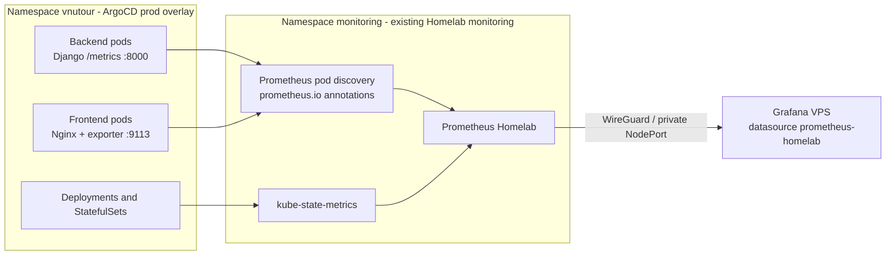

# Grafana Homelab workload metrics - kiến trúc và kế hoạch khôi phục

Ngày lập kế hoạch: 27/09/2026  
Codebase khảo sát: `D:\VNUTOUR`  
Nhánh thực hiện: `fix/grafana-homelab-workload-no-data`  
Base đã xác nhận: `origin/main` tại `0ea13a1`

Đây là kế hoạch triển khai, chưa phải biên bản xác nhận production đã được sửa.
Ảnh Grafana là bằng chứng về triệu chứng, không phải chỉ dẫn thao tác trên cluster.

## 1. Mục tiêu và phạm vi đã chốt

Dashboard bị ảnh hưởng là **K3S cluster monitoring on Homelab**, dùng datasource **Prometheus Homelab**. Các panel cAdvisor/cluster và hai panel CPU/memory theo pod vẫn có dữ liệu. Năm panel sau không có dữ liệu:

1. API requests/sec by view.
2. API latency p95 / p50.
3. Responses by status.
4. Replicas: desired vs available.
5. Nginx requests/sec (edge).

Phạm vi được chia thành hai pha:

- **Pha 1 - PR hiện tại:** khôi phục metric Django, Nginx và replica trên Prometheus Homelab; bỏ panel PostgreSQL khỏi dashboard hiện tại.
- **Pha 2 - hạng mục riêng:** đưa monitoring Homelab vào GitOps/Prometheus Operator một cách có kiểm soát. Không trộn migration này vào bản sửa khẩn cấp.

Monitoring PostgreSQL và dashboard riêng được hoãn theo quyết định ngày 28/09/2026; không cần role, Secret hoặc exporter PostgreSQL trong pha 1.

Không thay đổi staging, không mở Prometheus ra Internet, không đổi dashboard VPS, không thay đổi logic nghiệp vụ Django và không deploy từ máy phát triển trong PR.

## 2. Kết luận discovery

### 2.1. Những gì đang hoạt động

- Grafana VPS kết nối được datasource `prometheus-homelab`; nếu không, các panel cAdvisor và CPU/memory theo pod cũng sẽ trống.
- Prometheus Homelab đang scrape được cAdvisor.
- Backend đã cài `django-prometheus`, có middleware trước/sau request, endpoint `/metrics`, multiprocess directory và Gunicorn cleanup hook.
- Nginx config đã có `/nginx_status`, chỉ cho phép pod loopback; exporter sidecar có thể đọc endpoint này mà không công khai nó qua Ingress.
- Query trong dashboard sử dụng đúng các họ metric mà manifest legacy từng xuất: `django_http_*`, `nginx_http_requests_total` và `kube_deployment_*`.

### 2.2. Điểm đứt đã tái hiện bằng render

Production workload hiện được ArgoCD render từ `k8s/kustomize/overlays/prod`. Base dùng chung được thiết kế từ staging nên cố ý không có monitoring:

- Backend và backend-ops không có `prometheus.io/*` annotations.
- Frontend không có annotations và không có `nginx-exporter` sidecar.
- kube-state-metrics nằm trong manifest monitoring legacy, ngoài app overlay và ngoài phạm vi tự quản lý hiện tại của ArgoCD.

`kubectl kustomize k8s/kustomize/overlays/prod` đã xác nhận output trước sửa lỗi không có annotations Django hoặc Nginx exporter. Đây là nguyên nhân có độ tin cậy cao cho bốn panel ứng dụng. Panel replica cần kiểm tra riêng target kube-state-metrics trên cluster.

### 2.3. Vì sao test hiện tại không bắt được lỗi

Các test monitoring hiện tại chỉ xác nhận:

- Dashboard JSON hợp lệ.
- Tên panel tồn tại.
- Datasource Homelab tồn tại trong Helm values.

Test chưa render production để chứng minh producer của từng metric tồn tại. Vì vậy các test cũ vẫn pass trong Linux/WSL dù các panel không có data.

## 3. Kiến trúc mục tiêu pha 1



### 3.1. Component `prod-observability`

Tạo component mới, ví dụ `k8s/kustomize/components/prod-observability/`, và chỉ thêm nó vào overlay `prod` Homelab. Component chịu trách nhiệm cho producer metric của app, không quản lý Prometheus/Grafana.

Component gồm:

1. **Patch backend và backend-ops Deployments**
   - Thêm pod annotations scrape `true`, port `8000`, path `/metrics` cho cả hai.
   - `backend-ops` phục vụ `/api/admin/backups*` và `/media/*`, nên cũng cần
     được tính trong các panel request/response của Django.
   - Không thêm metrics port vào Service public; Prometheus scrape trực tiếp pod.
   - Giữ endpoint ngoài các prefix được Ingress proxy để metric không lộ qua hostname công khai.

2. **Patch frontend Deployment**
   - Thêm pod annotations scrape port `9113`, path `/metrics`.
   - Thêm `nginx/nginx-prometheus-exporter:1.5.3` sidecar, đọc `http://127.0.0.1/nginx_status`.
   - Khai báo named port `metrics`, resource requests/limits nhỏ và security context không đặc quyền giống manifest legacy.
   - Không expose port `9113` qua frontend Service hoặc Ingress.

### 3.2. kube-state-metrics

Panel replica không lấy dữ liệu từ cAdvisor. Trước khi sửa query, cần kiểm tra:

```promql
up{job="kubernetes-pods",app="kube-state-metrics"}
kube_deployment_spec_replicas{namespace="vnutour"}
kube_deployment_status_replicas_available{namespace="vnutour"}
```

Nếu pod/target thiếu, reconcile manifest hiện có `k8s/12.kube-state-metrics.yaml` trên cluster Homelab. Nếu target tồn tại nhưng DOWN, sửa theo lỗi target trước; không đổi dashboard thành metric cAdvisor vì hai loại metric trả lời hai câu hỏi khác nhau.

Pha 1 giữ kube-state-metrics ngoài app overlay để không làm ArgoCD app tier sở hữu tài nguyên namespace `monitoring` và ClusterRole. Việc sở hữu GitOps đầy đủ được giải quyết ở pha 2.

### 3.3. Giữ datasource và query ổn định

Không đổi datasource UID hoặc query chỉ để biến "No data" thành số 0. Query chỉ được sửa nếu Prometheus live chứng minh exporter đang phát tên/label khác contract hiện tại. Sau khi producer xuất hiện, probe và traffic thật sẽ tạo series cho Django/Nginx; kube-state-metrics phải xuất series ngay.

## 4. Kế hoạch thực hiện pha 1

### Bước 0 - Chụp baseline live, chỉ đọc

Port-forward Prometheus Homelab hoặc dùng endpoint private từ host được phép. Lưu bằng chứng không chứa Secret:

```bash
kubectl --context=HOMELAB_CONTEXT -n monitoring get pods -o wide
kubectl --context=HOMELAB_CONTEXT -n monitoring get deploy kube-state-metrics
kubectl --context=HOMELAB_CONTEXT -n monitoring port-forward svc/prometheus 9090:9090
```

Truy vấn `up`, target metadata và metric của năm panel cần khôi phục. Ghi lại target nào thiếu, target nào DOWN và lỗi scrape cụ thể. Không dùng ảnh Grafana làm bằng chứng duy nhất.

### Bước 1 - Thêm component observability chỉ cho Homelab prod

- Tạo `components/prod-observability/kustomization.yaml`.
- Tạo patch backend và backend-ops annotations.
- Tạo patch frontend annotations + Nginx exporter.
- Thêm component sau các component tạo workload và trước `images`; render phải chứng minh sidecar Nginx giữ đúng image.
- Không thêm component vào `staging` hoặc `prod-standby` trong PR này.

### Bước 2 - Khôi phục kube-state-metrics

- Nếu resource thiếu: server-side dry-run manifest legacy rồi apply vào Homelab.
- Nếu resource có nhưng target DOWN: kiểm tra RBAC, pod log, annotations, port `8080` và Prometheus target error.
- Nếu target UP nhưng query rỗng: kiểm tra metric names trực tiếp tại endpoint và label `namespace`; chỉ khi đó mới cập nhật query dashboard.

### Bước 3 - Bổ sung kiểm thử chống tái diễn

Mở rộng test để render manifest, không chỉ tìm chuỗi trong source:

- Prod backend và backend-ops có đúng annotations `8000` + `/metrics`.
- Prod frontend có annotations `9113`, đúng exporter image/argument/port và resource/security settings.
- Prod không có postgres-exporter hoặc Secret reference; staging và prod-standby không nhận patch Nginx.
- Dashboard Homelab không còn panel PostgreSQL.
- Dashboard vẫn dùng datasource placeholder được installer map sang `prometheus-homelab`.
- Tập query dashboard tham chiếu đúng metric contract được producer cung cấp.
- Render mọi Kustomize overlay và kubeconform vẫn pass.

Thêm một test contract ánh xạ panel → producer để tránh trạng thái "panel tồn tại nhưng không workload nào xuất metric".

### Bước 4 - Rollout và nghiệm thu

1. Merge PR và để ArgoCD sync component app-tier; không `kubectl apply` file app từ laptop vì ArgoCD self-heal sẽ ghi đè drift.
2. Theo dõi rollout backend/backend-ops/frontend và health ứng dụng.
3. Chờ tối thiểu hai scrape interval; kiểm tra target `up == 1`.
4. Gọi vài endpoint API hợp lệ và tải frontend để tạo traffic kiểm chứng.
5. Chạy PromQL nghiệm thu bên dưới trước khi kiểm tra Grafana.
6. Chụp ảnh dashboard cùng time range và datasource đã chọn.
7. Quan sát ít nhất 15 phút để loại trừ counter reset, crash loop hoặc lỗi multiprocess sau rollout.

## 5. PromQL và tiêu chí nghiệm thu

| Panel              | Truy vấn kiểm chứng                                              | Kết quả tối thiểu                                        |
| ------------------ | ---------------------------------------------------------------- | -------------------------------------------------------- |
| API requests/sec   | `django_http_requests_total_by_view_transport_method_total`      | Có series từ backend target; rate có giá trị sau traffic |
| API latency        | `django_http_requests_latency_seconds_by_view_method_bucket`     | Có bucket `le`; p50/p95 trả kết quả                      |
| Responses status   | `django_http_responses_total_by_status_total`                    | Có series `status`; rate trả kết quả                     |
| Replicas           | `kube_deployment_spec_replicas{namespace="vnutour"}`             | Có mọi Deployment prod cần theo dõi                      |
| Replicas available | `kube_deployment_status_replicas_available{namespace="vnutour"}` | Có series cùng deployment labels                         |
| Nginx              | `nginx_http_requests_total`                                      | Có counter; rate tăng sau request frontend               |

Ngoài việc panel có data, phải kiểm tra:

- Không có scrape target mới ở trạng thái DOWN.
- Backend/frontend vẫn Ready và API/website không suy giảm.
- PostgreSQL/Patroni không bị rollout do thay đổi monitoring.
- Cardinality hợp lý; dashboard không tạo query theo URL hoặc user-controlled label có cardinality cao.

## 6. Rollback pha 1

- Revert commit thêm `prod-observability` để ArgoCD loại annotations và Nginx sidecar.
- Nếu Nginx exporter làm frontend không Ready, rollback riêng patch sidecar trong khi vẫn giữ backend/kube-state-metrics.
- Việc reconcile kube-state-metrics được rollback theo manifest monitoring, độc lập với app overlay.

## 7. Pha 2 - migration monitoring GitOps riêng

Tạo issue/PR riêng sau khi năm panel đã ổn định:

1. Kiểm kê owner của Prometheus legacy, kube-state-metrics, node-exporter, PVC, ClusterRole và NodePort `30900` trên Homelab.
2. Chọn một mô hình đích duy nhất: kube-prometheus-stack/Operator được quản lý bởi ArgoCD Application riêng cho cluster Homelab.
3. Chuyển annotation discovery thành PodMonitor/ServiceMonitor hoặc `additionalScrapeConfigs` có kiểm thử; không chạy hai scraper trùng lâu dài.
4. Chuyển alert rules sang PrometheusRule, giữ semantics và kiểm tra rule trước cutover.
5. Giữ datasource Grafana UID `prometheus-homelab` ổn định; nếu endpoint đổi, thay datasource provisioning mà không clone dashboard.
6. Lập kế hoạch TSDB/PVC retention. Không xóa Prometheus/PVC legacy để "cài lại".
7. Chạy song song có thời hạn, so sánh cardinality/query, rồi cutover và gỡ stack cũ bằng thao tác có rollback.

Pha 2 hoàn tất khi monitoring resources có một owner GitOps rõ ràng, dashboard vẫn giữ dữ liệu, alert rules được đánh giá, và không còn tài nguyên legacy mồ côi.

## 8. Rủi ro và biện pháp

| Rủi ro                                              | Biện pháp                                                                   |
| --------------------------------------------------- | --------------------------------------------------------------------------- |
| Patch component vô tình áp dụng cho staging/standby | Chỉ include trong overlay prod; test negative hai overlay còn lại           |
| Exporter sidecar làm frontend vượt resource budget  | Requests/limits nhỏ, kiểm tra render và node capacity trước rollout         |
| Annotation có nhưng Prometheus không discover       | Xác nhận target page/relabel config và metric endpoint, không chỉ nhìn YAML |
| Query rate vẫn "No data" khi chưa có traffic        | Tạo request kiểm chứng và xem raw counter trước `rate()`                    |
| KSM bị ArgoCD prune hoặc có owner mơ hồ             | Pha 1 reconcile riêng; pha 2 tạo Application monitoring độc lập             |
| Trùng scrape khi migration                          | So sánh labels/external labels; cutover có thời hạn và loại một owner       |

## 9. Cổng chất lượng trước merge

Chạy trên Linux giống CI:

```bash
python3 -m unittest discover -s k8s/monitoring/test -p 'test_*.py' -v
kubectl kustomize k8s/kustomize/overlays/prod > /tmp/prod.yaml
kubectl kustomize k8s/kustomize/overlays/prod-standby > /tmp/prod-standby.yaml
kubectl kustomize k8s/kustomize/overlays/staging > /tmp/staging.yaml
kubeconform -strict -summary -ignore-missing-schemas /tmp/prod.yaml
kubeconform -strict -summary -ignore-missing-schemas /tmp/prod-standby.yaml
kubeconform -strict -summary -ignore-missing-schemas /tmp/staging.yaml
shellcheck k8s/monitoring/install/deploy.sh k8s/monitoring/install/monitoring-install.sh
```

Review rendered manifests, không chỉ source patch. Kiểm tra Git diff không chứa Secret, password, DSN, kubeconfig, cluster response hay file tạm.

## 10. Quality review của kế hoạch

Kế hoạch này đáp ứng các điều kiện đã xác nhận:

- Không chẩn đoán datasource hỏng khi cAdvisor thực tế vẫn có data.
- Tách nguyên nhân producer/scrape cho Django, Nginx và kube-state-metrics.
- Không dùng thay đổi query để che metric bị thiếu.
- Không buộc database rollout vì monitoring.
- Không mở rộng pha khôi phục thành migration monitoring toàn cụm.
- Có preflight, test contract, rollout, nghiệm thu PromQL và rollback độc lập.
- Có đường chuyển tiếp sang GitOps mà không tạo hai owner vĩnh viễn.

Điều kiện đóng pha 1: cả năm panel còn lại có dữ liệu trong time range phù hợp, raw PromQL và target health cùng xác nhận, workload ứng dụng vẫn khỏe, và test mới thất bại nếu exporter/annotation bị loại khỏi production render trong tương lai.
